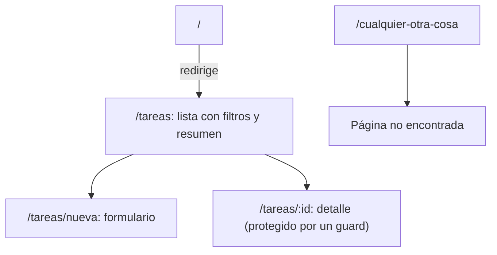

Llegó el momento de juntarlo todo. En este módulo vas a construir **en tu ordenador**, de principio a fin, una aplicación completa: **Mis tareas**, una lista de tareas con prioridades. No es un ejercicio de huecos: escribirás cada archivo, lo verás funcionar en el navegador y terminarás con una carpeta `dist/` lista para publicar.

Cada lección es una **etapa**. Al final de cada una la app compila y funciona; la siguiente le añade una capa. Si algo no te sale, compara tu archivo con el de la lección: el código que verás está compilado y probado con Angular 22.

> [!analogia]
> Construir una casa por fases. Primero los cimientos y las paredes (las rutas y el esqueleto). Después la instalación de agua (los datos). Luego las puertas y ventanas (el formulario y el detalle). Y al final, la inspección (las pruebas) y la entrega de llaves (el build). En cada fase la casa «se sostiene»; no esperas al final para ver si funciona.

## Qué vas a construir



| Etapa | Qué añade | Módulos que repasa |
| --- | --- | --- |
| 1. Esqueleto | Proyecto, modelo, cabecera, rutas y página 404 | 4, 5, 11 |
| 2. Datos | JSON de ejemplo, `HttpClient` y un servicio con signals | 7, 10, 13, 15 |
| 3. Formulario | Crear tareas con un formulario reactivo y validaciones | 12 |
| 4. Detalle | Ruta con parámetro, guard y `@defer` | 11, 17 |
| 5. Entrega | Pruebas con Vitest y `ng build` final | 18, 21 |

## Paso 1: crear el proyecto

En una terminal, en la carpeta donde guardas tus proyectos:

```bash
ng new mis-tareas --defaults
cd mis-tareas
ng serve
```

`--defaults` acepta las respuestas por defecto (CSS, sin SSR). Abre `http://localhost:4200`: verás la página de bienvenida de Angular. Deja `ng serve` funcionando en esa terminal y abre otra para los siguientes comandos.

## Paso 2: generar las piezas

```bash
ng generate interface tareas/tarea
ng generate component tareas/lista-tareas
ng generate component no-encontrada
```

La CLI crea la carpeta `src/app/tareas/` con el modelo y el componente de la lista, y `src/app/no-encontrada/` para la página 404.

## Paso 3: el modelo

Sustituye el contenido de `tarea.ts`:

```typescript
// src/app/tareas/tarea.ts
export type Prioridad = 'alta' | 'media' | 'baja';

export interface Tarea {
  id: number;
  titulo: string;
  prioridad: Prioridad;
  hecha: boolean;
}
```

- `Prioridad` es una **unión de literales** (módulo 2): solo admite esos tres textos. Si escribes `'urgente'`, TypeScript se queja al compilar.
- `Tarea` describe la forma de cada tarea. No genera código JavaScript: solo sirve para que TypeScript compruebe que usas bien los datos.

## Paso 4: la cabecera y el hueco de las rutas

```typescript
// src/app/app.ts
import { Component } from '@angular/core';
import { RouterLink, RouterLinkActive, RouterOutlet } from '@angular/router';

@Component({
  imports: [RouterOutlet, RouterLink, RouterLinkActive],
  selector: 'app-root',
  styleUrl: './app.css',
  templateUrl: './app.html',
})
export class App {}
```

Hemos quitado el signal `title` que traía el proyecto y hemos añadido dos directivas de `@angular/router`: `RouterLink` (enlaces que navegan sin recargar) y `RouterLinkActive` (marca el enlace de la página actual).

Borra **todo** el contenido de `app.html` (la página de bienvenida) y escribe:

```html
<!-- src/app/app.html -->
<header>
  <h1>Mis tareas</h1>
  <nav>
    <a routerLink="/tareas" routerLinkActive="activo" [routerLinkActiveOptions]="{ exact: true }">Lista</a>
    <a routerLink="/tareas/nueva" routerLinkActive="activo">Nueva tarea</a>
  </nav>
</header>

<main>
  <router-outlet />
</main>
```

- `routerLinkActive="activo"` añade la clase CSS `activo` al enlace cuando su ruta está abierta.
- `{ exact: true }` en «Lista» evita que también se marque en `/tareas/nueva` (que empieza por `/tareas`).
- `<router-outlet />` es el hueco donde el router pinta la página de cada ruta.

```css
/* src/app/app.css */
header {
  display: flex;
  align-items: center;
  justify-content: space-between;
  padding: 0 1rem;
  border-bottom: 1px solid #ddd;
}

nav a {
  margin-left: 1rem;
  color: #555;
  text-decoration: none;
}

nav a.activo {
  color: #1d4ed8;
  font-weight: bold;
}

main {
  max-width: 40rem;
  margin: 0 auto;
  padding: 1rem;
}
```

Y unos estilos globales mínimos:

```css
/* src/styles.css */
/* Estilos globales: afectan a toda la aplicación */
body {
  margin: 0;
  font-family: system-ui, sans-serif;
  color: #222;
}

button {
  cursor: pointer;
}
```

En `src/index.html`, cambia `lang="en"` por `lang="es"` y el título por `<title>Mis tareas</title>`.

## Paso 5: las rutas y sus páginas

```typescript
// src/app/app.routes.ts
import { Routes } from '@angular/router';
import { ListaTareas } from './tareas/lista-tareas/lista-tareas';
import { NoEncontrada } from './no-encontrada/no-encontrada';

export const routes: Routes = [
  { path: '', redirectTo: 'tareas', pathMatch: 'full' },
  { path: 'tareas', component: ListaTareas, title: 'Mis tareas' },
  { path: '**', component: NoEncontrada, title: 'Página no encontrada' },
];
```

- La ruta vacía redirige a `/tareas`. `pathMatch: 'full'` exige que la URL sea exactamente vacía; sin él, todas las rutas encajarían.
- `title` cambia el texto de la pestaña del navegador.
- `'**'` atrapa cualquier otra URL. Va siempre la última.

```html
<!-- src/app/tareas/lista-tareas/lista-tareas.html -->
<h2>Lista de tareas</h2>
<p>Aquí aparecerán tus tareas.</p>
```

```typescript
// src/app/no-encontrada/no-encontrada.ts
import { Component } from '@angular/core';
import { RouterLink } from '@angular/router';

@Component({
  imports: [RouterLink],
  selector: 'app-no-encontrada',
  styleUrl: './no-encontrada.css',
  templateUrl: './no-encontrada.html',
})
export class NoEncontrada {}
```

```html
<!-- src/app/no-encontrada/no-encontrada.html -->
<h2>Esta página no existe</h2>
<p><a routerLink="/tareas">Volver a la lista</a></p>
```

## Lo que deberías ver

Guarda todo. El navegador se recarga solo y te lleva de `/` a `/tareas`:

```pantalla
@url localhost:4200/tareas
<header style="display:flex;justify-content:space-between;align-items:center;border-bottom:1px solid #ddd;padding:0 1rem">
  <h1>Mis tareas</h1>
  <nav><a style="color:#1d4ed8;font-weight:bold">Lista</a> &nbsp; <a style="color:#555">Nueva tarea</a></nav>
</header>
<main style="padding:1rem">
  <h2>Lista de tareas</h2>
  <p>Aquí aparecerán tus tareas.</p>
</main>
```

Escribe a mano `localhost:4200/lo-que-sea`:

```pantalla
@url localhost:4200/lo-que-sea
<header style="display:flex;justify-content:space-between;align-items:center;border-bottom:1px solid #ddd;padding:0 1rem">
  <h1>Mis tareas</h1>
  <nav><a style="color:#555">Lista</a> &nbsp; <a style="color:#555">Nueva tarea</a></nav>
</header>
<main style="padding:1rem">
  <h2>Esta página no existe</h2>
  <p><a href="#">Volver a la lista</a></p>
</main>
```

> [!cuidado]
> El enlace «Nueva tarea» todavía lleva a la página 404: esa ruta no existe hasta la etapa 3. Y si ejecutas `ng test` ahora, fallarán algunas pruebas generadas (por ejemplo, la que busca «Hello, mis-tareas» en el `<h1>`). Es normal: las arreglarás en la etapa 5 y entenderás por qué fallan.

Checklist de la etapa:

- `ng serve` funciona sin errores en la terminal.
- `/` redirige a `/tareas` y la pestaña dice «Mis tareas».
- El enlace «Lista» aparece en azul y negrita.
- Una URL inventada muestra «Esta página no existe» y su enlace te devuelve a la lista.

> [!prueba]
> Añade una tercera ruta de prueba: en `app.routes.ts`, antes de `'**'`, escribe `{ path: 'acerca', component: NoEncontrada, title: 'Acerca' }` y visita `localhost:4200/acerca`. Verás la página 404 con otro título de pestaña. Después bórrala: era solo para ver que el orden de las rutas importa.

> [!resumen]
> - `ng new mis-tareas --defaults` y `ng generate` crean el proyecto y las piezas.
> - El modelo `Tarea` usa una unión de literales para la prioridad.
> - `App` tiene la cabecera con `routerLink`/`routerLinkActive` y el `<router-outlet />`.
> - Las rutas: redirección de `''`, la lista en `tareas` y la 404 con `'**'` al final.
