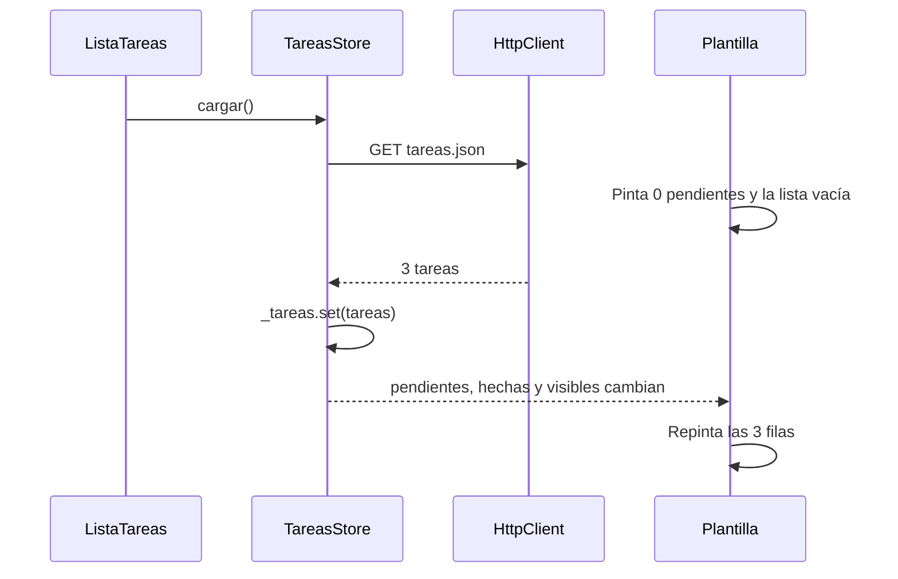

La app ya tiene esqueleto, pero la lista está vacía. En esta etapa le das datos: un archivo JSON hará de backend falso, `HttpClient` lo descargará y un **servicio con signals** guardará las tareas para que cualquier pantalla las lea y las cambie.

> [!analogia]
> El servicio es la despensa de la casa. La cocina (la lista), el comedor (el detalle) y quien hace la compra (el formulario) no guardan comida cada uno en su habitación: todos van a la misma despensa. Si alguien añade algo, todos lo ven.

## Paso 1: el backend falso

Crea `public/tareas.json`. Todo lo que hay en `public/` se sirve tal cual en la raíz del sitio, así que estará en `http://localhost:4200/tareas.json`:

```json
[
  { "id": 1, "titulo": "Comprar pan", "prioridad": "media", "hecha": true },
  { "id": 2, "titulo": "Estudiar signals", "prioridad": "alta", "hecha": false },
  { "id": 3, "titulo": "Regar las plantas", "prioridad": "baja", "hecha": false }
]
```

> [!prueba]
> Abre `http://localhost:4200/tareas.json` en el navegador: verás el JSON. Es exactamente lo que recibirá `HttpClient`, igual que si viniera de un servidor de verdad.

## Paso 2: HttpClient en la configuración

```typescript
// src/app/app.config.ts
import { ApplicationConfig, provideBrowserGlobalErrorListeners } from '@angular/core';
import { provideHttpClient } from '@angular/common/http';
import { provideRouter } from '@angular/router';
import { routes } from './app.routes';

export const appConfig: ApplicationConfig = {
  providers: [provideBrowserGlobalErrorListeners(), provideRouter(routes), provideHttpClient()],
};
```

`provideHttpClient` viene de `@angular/common/http`, la parte de `@angular/common` que hace peticiones HTTP. En Angular 22, `HttpClient` ya está disponible aunque no lo pongas y usa la API `fetch` del navegador por defecto (por eso ya no hace falta `withFetch()`, que verás en código anterior). Lo dejamos escrito porque es el sitio donde añadirías interceptores (`withInterceptors(...)`, módulo 13) y deja claro que la app usa HTTP.

## Paso 3: el servicio de tareas

```bash
ng generate service tareas/tareas-store
```

```typescript
// src/app/tareas/tareas-store.ts
import { HttpClient } from '@angular/common/http';
import { Service, computed, inject, signal } from '@angular/core';
import { firstValueFrom } from 'rxjs';
import { Prioridad, Tarea } from './tarea';

@Service()
export class TareasStore {
  private readonly http = inject(HttpClient);
  private readonly _tareas = signal<Tarea[]>([]);
  private carga: Promise<void> | null = null;

  readonly tareas = this._tareas.asReadonly();
  readonly pendientes = computed(() => this._tareas().filter((t) => !t.hecha).length);
  readonly hechas = computed(() => this._tareas().length - this.pendientes());

  cargar(): Promise<void> {
    this.carga ??= firstValueFrom(this.http.get<Tarea[]>('tareas.json')).then((tareas) =>
      this._tareas.set(tareas),
    );
    return this.carga;
  }

  porId(id: number): Tarea | undefined {
    return this._tareas().find((t) => t.id === id);
  }

  agregar(titulo: string, prioridad: Prioridad): void {
    const id = Math.max(0, ...this._tareas().map((t) => t.id)) + 1;
    this._tareas.update((tareas) => [...tareas, { id, titulo, prioridad, hecha: false }]);
  }

  alternar(id: number): void {
    this._tareas.update((tareas) =>
      tareas.map((t) => (t.id === id ? { ...t, hecha: !t.hecha } : t)),
    );
  }

  borrar(id: number): void {
    this._tareas.update((tareas) => tareas.filter((t) => t.id !== id));
  }
}
```

Línea a línea:

- **`@Service()`**: el decorador con el que Angular 22 genera los servicios. Hay una sola instancia para toda la app (un *singleton*), así que todas las pantallas comparten las mismas tareas. En código anterior verás `@Injectable({ providedIn: 'root' })`.
- **`_tareas`**: el estado, un signal **privado**. Nadie de fuera puede hacer `set`.
- **`tareas`**: la versión de **solo lectura** que ven los componentes (`asReadonly`).
- **`pendientes` y `hechas`**: estado derivado con `computed`. Se recalculan solos cuando cambia `_tareas`.
- **`cargar()`**: `http.get<Tarea[]>('tareas.json')` devuelve un *observable* frío: no hace nada hasta que alguien se suscribe. `firstValueFrom` (de `rxjs`) se suscribe, espera el primer valor y lo convierte en una **promesa**. El operador `??=` guarda esa promesa la primera vez y la reutiliza después: aunque la lista y el guard (etapa 4) llamen a `cargar()`, el JSON se pide **una sola vez**. La URL es relativa (`tareas.json`, sin `/`): se resuelve respecto al `<base href>`.
- **`agregar`, `alternar`, `borrar`**: cambian el estado **creando listas nuevas** (`[...tareas, nueva]`, `map`, `filter`) en vez de modificar la existente. Así el signal detecta el cambio. `agregar` calcula el siguiente `id` como el mayor actual más uno.

## Paso 4: la lista

```typescript
// src/app/tareas/lista-tareas/lista-tareas.ts
import { Component, computed, inject, signal } from '@angular/core';
import { RouterLink } from '@angular/router';
import { TareasStore } from '../tareas-store';

type Filtro = 'todas' | 'pendientes' | 'hechas';

@Component({
  imports: [RouterLink],
  selector: 'app-lista-tareas',
  styleUrl: './lista-tareas.css',
  templateUrl: './lista-tareas.html',
})
export class ListaTareas {
  protected readonly store = inject(TareasStore);
  protected readonly filtro = signal<Filtro>('todas');

  protected readonly visibles = computed(() => {
    const tareas = this.store.tareas();
    switch (this.filtro()) {
      case 'pendientes':
        return tareas.filter((t) => !t.hecha);
      case 'hechas':
        return tareas.filter((t) => t.hecha);
      default:
        return tareas;
    }
  });

  constructor() {
    this.store.cargar();
  }
}
```

- El filtro elegido es **estado local** de la pantalla: un signal propio, no del servicio.
- `visibles` depende de **dos** signals: `store.tareas()` y `filtro()`. Si cambia cualquiera, se recalcula.
- En el constructor pide la carga. No espera el resultado: cuando llegue, el signal cambiará y la plantilla se repintará sola.

```html
<!-- src/app/tareas/lista-tareas/lista-tareas.html -->
<h2>Lista de tareas</h2>

<p>Pendientes: {{ store.pendientes() }} · Hechas: {{ store.hechas() }}</p>

<div class="filtros">
  <button (click)="filtro.set('todas')" [class.activo]="filtro() === 'todas'">Todas</button>
  <button (click)="filtro.set('pendientes')" [class.activo]="filtro() === 'pendientes'">
    Pendientes
  </button>
  <button (click)="filtro.set('hechas')" [class.activo]="filtro() === 'hechas'">Hechas</button>
</div>

<ul>
  @for (tarea of visibles(); track tarea.id) {
    <li [class.hecha]="tarea.hecha">
      <input type="checkbox" [checked]="tarea.hecha" (change)="store.alternar(tarea.id)" />
      <a [routerLink]="['/tareas', tarea.id]">{{ tarea.titulo }}</a>
      <span class="prioridad {{ tarea.prioridad }}">{{ tarea.prioridad }}</span>
    </li>
  } @empty {
    <li class="vacia">No hay tareas en esta vista.</li>
  }
</ul>
```

- `@for … track tarea.id`: una fila por tarea; `track` le dice a Angular cómo reconocer cada fila para no repintarlas todas cuando cambia una.
- `@empty`: lo que se ve si la lista filtrada está vacía.
- `[checked]` + `(change)`: la casilla refleja el estado y, al pulsarla, pide al servicio que lo cambie.
- `[routerLink]="['/tareas', tarea.id]"` construye `/tareas/2`. Esa ruta llega en la etapa 4.
- `class="prioridad {{ tarea.prioridad }}"` añade la clase `alta`, `media` o `baja` para colorear la etiqueta.

```css
/* src/app/tareas/lista-tareas/lista-tareas.css */
ul {
  list-style: none;
  padding: 0;
}

li {
  display: flex;
  align-items: center;
  gap: 0.5rem;
  padding: 0.5rem 0;
  border-bottom: 1px solid #eee;
}

li.hecha a {
  text-decoration: line-through;
  color: #888;
}

.filtros button.activo {
  font-weight: bold;
}

.prioridad {
  margin-left: auto;
  font-size: 0.8rem;
  padding: 0 0.4rem;
  border-radius: 4px;
}

.alta {
  background: #fee2e2;
}

.media {
  background: #fef9c3;
}

.baja {
  background: #dcfce7;
}
```

## Qué pasa al abrir /tareas



## Lo que deberías ver

```pantalla
@url localhost:4200/tareas
<h2>Lista de tareas</h2>
<p>Pendientes: 2 · Hechas: 1</p>
<p><button><b>Todas</b></button> <button>Pendientes</button> <button>Hechas</button></p>
<ul style="list-style:none;padding:0">
  <li><input type="checkbox" checked> <s style="color:#888">Comprar pan</s> <small style="background:#fef9c3">media</small></li>
  <li><input type="checkbox"> <a href="#">Estudiar signals</a> <small style="background:#fee2e2">alta</small></li>
  <li><input type="checkbox"> <a href="#">Regar las plantas</a> <small style="background:#dcfce7">baja</small></li>
</ul>
```

> [!cuidado]
> Si la lista sale vacía, abre las herramientas del navegador (`F12`), pestaña **Red** (*Network*), y busca `tareas.json`. Un 404 casi siempre significa que el archivo no está en `public/` (está en `src/` o en la raíz) o que el nombre no coincide. Y recuerda: como es un archivo estático, los cambios que hagas (añadir, marcar, borrar) viven en memoria y **se pierden al recargar**. Con un backend de verdad, el servicio haría también `post`, `put` y `delete`.

Checklist de la etapa:

- Se ven las tres tareas y el contador «Pendientes: 2 · Hechas: 1».
- Al marcar una casilla, el título se tacha y el contador cambia al instante.
- Los botones de filtro muestran solo las pendientes o solo las hechas; un filtro sin resultados muestra «No hay tareas en esta vista».

> [!resumen]
> - Un JSON en `public/` hace de backend falso; `HttpClient` lo pide igual que a una API.
> - `TareasStore` guarda el estado en un signal privado, lo expone de solo lectura y deriva contadores con `computed`.
> - `firstValueFrom` convierte el observable en promesa, y `??=` evita pedir el JSON dos veces.
> - La lista combina el estado del servicio con un filtro local en un `computed`.
