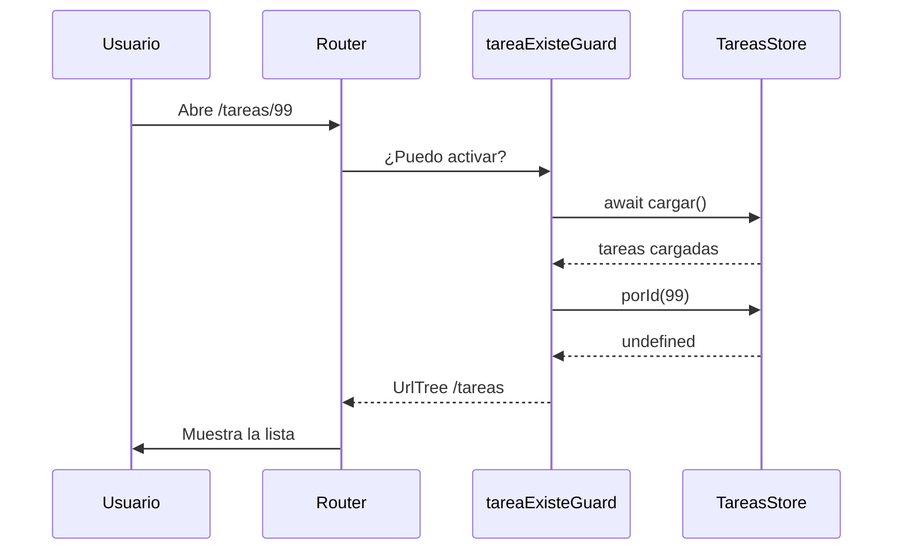

Los títulos de la lista ya son enlaces a `/tareas/1`, `/tareas/2`… pero llevan a la página 404. En esta etapa creas la **página de detalle**, que recibe el `id` de la URL como un `input()`; la proteges con un **guard** que devuelve a la lista si la tarea no existe; y añades a la lista un **resumen** que se carga de forma diferida con `@defer`.

> [!analogia]
> El guard es el portero de una sala de reuniones: antes de dejarte entrar a «la reunión 7», mira la agenda. Si la reunión 7 no existe, no te deja pasar a una sala vacía: te acompaña de vuelta a recepción.

## Paso 1: generar las piezas

```bash
ng generate component tareas/detalle-tarea
ng generate component tareas/resumen-tareas
ng generate guard tareas/tarea-existe --implements CanActivate
```

`--implements CanActivate` responde por adelantado a la pregunta de qué tipo de guard quieres. La CLI crea `tarea-existe-guard.ts` con una función `tareaExisteGuard` que, de momento, siempre devuelve `true`.

## Paso 2: los parámetros de ruta como inputs

En `app.config.ts`, añade `withComponentInputBinding()` al router:

```typescript
// src/app/app.config.ts
import { ApplicationConfig, provideBrowserGlobalErrorListeners } from '@angular/core';
import { provideHttpClient } from '@angular/common/http';
import { provideRouter, withComponentInputBinding } from '@angular/router';
import { routes } from './app.routes';

export const appConfig: ApplicationConfig = {
  providers: [
    provideBrowserGlobalErrorListeners(),
    provideRouter(routes, withComponentInputBinding()),
    provideHttpClient(),
  ],
};
```

Con esta opción, el router pasa los parámetros de la URL (`:id`), los *query params* y los datos de la ruta a los `input()` del componente que tengan el mismo nombre. Sin ella, tendrías que inyectar `ActivatedRoute` y leer el parámetro a mano.

## Paso 3: la página de detalle

```typescript
// src/app/tareas/detalle-tarea/detalle-tarea.ts
import { Component, computed, inject, input } from '@angular/core';
import { Router, RouterLink } from '@angular/router';
import { TareasStore } from '../tareas-store';

@Component({
  imports: [RouterLink],
  selector: 'app-detalle-tarea',
  styleUrl: './detalle-tarea.css',
  templateUrl: './detalle-tarea.html',
})
export class DetalleTarea {
  private readonly store = inject(TareasStore);
  private readonly router = inject(Router);

  readonly id = input.required<string>();
  protected readonly tarea = computed(() => this.store.porId(Number(this.id())));

  protected alternar(): void {
    this.store.alternar(Number(this.id()));
  }

  protected borrar(): void {
    this.store.borrar(Number(this.id()));
    this.router.navigate(['/tareas']);
  }
}
```

- `id = input.required<string>()`: el router lo rellena con el `:id` de la URL. Siempre llega como **texto** (`'2'`), porque una URL es texto; por eso se convierte con `Number(...)`.
- `tarea` es un `computed` que busca la tarea en el servicio. Si la marcas como hecha, el servicio cambia y el detalle se actualiza solo.
- `borrar()` elimina la tarea y vuelve a la lista: quedarse en el detalle de algo borrado no tendría sentido.

```html
<!-- src/app/tareas/detalle-tarea/detalle-tarea.html -->
@if (tarea(); as t) {
  <h2>{{ t.titulo }}</h2>
  <p>Prioridad: {{ t.prioridad }}</p>
  <p>Estado: {{ t.hecha ? 'Hecha' : 'Pendiente' }}</p>

  <button (click)="alternar()">
    {{ t.hecha ? 'Marcar como pendiente' : 'Marcar como hecha' }}
  </button>
  <button class="peligro" (click)="borrar()">Borrar</button>
}

<p><a routerLink="/tareas">← Volver a la lista</a></p>
```

`@if (tarea(); as t)` comprueba que la tarea existe y, a la vez, le da el nombre corto `t` dentro del bloque. TypeScript sabe que dentro `t` no es `undefined`.

```css
/* src/app/tareas/detalle-tarea/detalle-tarea.css */
button {
  margin-right: 0.5rem;
}

.peligro {
  color: #b91c1c;
}
```

## Paso 4: el guard

```typescript
// src/app/tareas/tarea-existe-guard.ts
import { inject } from '@angular/core';
import { CanActivateFn, Router } from '@angular/router';
import { TareasStore } from './tareas-store';

export const tareaExisteGuard: CanActivateFn = async (route) => {
  const store = inject(TareasStore);
  const router = inject(Router);

  await store.cargar();
  const id = Number(route.paramMap.get('id'));

  return store.porId(id) ? true : router.createUrlTree(['/tareas']);
};
```

- Un guard funcional es una función de tipo `CanActivateFn`. Se ejecuta en un contexto de inyección, así que puede usar `inject()`.
- Es `async`: devuelve una promesa y el router **espera** a que se resuelva antes de navegar.
- `await store.cargar()`: si el usuario abre directamente `localhost:4200/tareas/2` (sin pasar por la lista), las tareas aún no están cargadas. El guard las carga primero. Gracias al `??=` de la etapa 2, si ya estaban cargadas no se vuelve a pedir el JSON.
- `route.paramMap.get('id')` lee el parámetro de la ruta que se quiere abrir.
- Devuelve `true` (adelante) o un `UrlTree`, una dirección a la que el router redirige en lugar de entrar. Es mejor que llamar a `router.navigate` dentro del guard: el router gestiona la redirección como parte de la misma navegación.



## Paso 5: la ruta

```typescript
// src/app/app.routes.ts
import { Routes } from '@angular/router';
import { ListaTareas } from './tareas/lista-tareas/lista-tareas';
import { NoEncontrada } from './no-encontrada/no-encontrada';
import { tareaExisteGuard } from './tareas/tarea-existe-guard';

export const routes: Routes = [
  { path: '', redirectTo: 'tareas', pathMatch: 'full' },
  { path: 'tareas', component: ListaTareas, title: 'Mis tareas' },
  {
    path: 'tareas/nueva',
    loadComponent: () => import('./tareas/nueva-tarea/nueva-tarea').then((m) => m.NuevaTarea),
    title: 'Nueva tarea',
  },
  {
    path: 'tareas/:id',
    loadComponent: () =>
      import('./tareas/detalle-tarea/detalle-tarea').then((m) => m.DetalleTarea),
    canActivate: [tareaExisteGuard],
    title: 'Detalle de la tarea',
  },
  { path: '**', component: NoEncontrada, title: 'Página no encontrada' },
];
```

> [!cuidado]
> El orden importa: `tareas/nueva` debe ir **antes** que `tareas/:id`. Si no, al abrir `/tareas/nueva` el router encajaría primero `:id` con el valor `'nueva'`, el guard no encontraría la tarea «nueva» y te devolvería a la lista. Nunca verías el formulario.

## Paso 6: el resumen, con @defer

El resumen calcula qué porcentaje de tareas está hecho. No es lo primero que necesita ver el usuario, así que lo cargaremos cuando el navegador esté libre.

```typescript
// src/app/tareas/resumen-tareas/resumen-tareas.ts
import { Component, computed, inject } from '@angular/core';
import { TareasStore } from '../tareas-store';

@Component({
  selector: 'app-resumen-tareas',
  styleUrl: './resumen-tareas.css',
  templateUrl: './resumen-tareas.html',
})
export class ResumenTareas {
  private readonly store = inject(TareasStore);

  protected readonly total = computed(() => this.store.tareas().length);
  protected readonly porcentaje = computed(() =>
    this.total() === 0 ? 0 : Math.round((this.store.hechas() / this.total()) * 100),
  );
}
```

(La CLI genera el componente con `imports: []`; puedes borrar esa línea si no importa nada.)

```html
<!-- src/app/tareas/resumen-tareas/resumen-tareas.html -->
<section>
  <h3>Resumen</h3>
  <p>Has completado {{ porcentaje() }}% de {{ total() }} tareas.</p>
  <progress [value]="porcentaje()" max="100"></progress>
</section>
```

```css
/* src/app/tareas/resumen-tareas/resumen-tareas.css */
section {
  margin-top: 2rem;
  padding: 1rem;
  border-radius: 8px;
  background: #f1f5f9;
}

progress {
  width: 100%;
}
```

En la lista, importa `ResumenTareas`:

```typescript
// src/app/tareas/lista-tareas/lista-tareas.ts (solo cambian los imports)
import { Component, computed, inject, signal } from '@angular/core';
import { RouterLink } from '@angular/router';
import { ResumenTareas } from '../resumen-tareas/resumen-tareas';
import { TareasStore } from '../tareas-store';

type Filtro = 'todas' | 'pendientes' | 'hechas';

@Component({
  imports: [RouterLink, ResumenTareas],
  selector: 'app-lista-tareas',
  styleUrl: './lista-tareas.css',
  templateUrl: './lista-tareas.html',
})
```

Y añade al final de `lista-tareas.html`:

```html
@defer (on idle) {
  <app-resumen-tareas />
} @placeholder {
  <p>Cargando resumen…</p>
}
```

`@defer (on idle)` separa `ResumenTareas` en su propio archivo y lo descarga cuando el navegador termina el trabajo urgente. Mientras, se ve el `@placeholder`. Aunque el componente aparece en `imports`, Angular sabe que solo se usa dentro de un `@defer` y no lo mete en el paquete principal.

## Lo que deberías ver

Pulsa «Estudiar signals» en la lista:

```pantalla
@url localhost:4200/tareas/2
<h2>Estudiar signals</h2>
<p>Prioridad: alta</p>
<p>Estado: Pendiente</p>
<button>Marcar como hecha</button> <button style="color:#b91c1c">Borrar</button>
<p><a href="#">← Volver a la lista</a></p>
```

Y en la lista, debajo de las tareas:

```pantalla
@url localhost:4200/tareas
<section style="padding:1rem;border-radius:8px;background:#f1f5f9">
  <h3>Resumen</h3>
  <p>Has completado 33% de 3 tareas.</p>
  <progress value="33" max="100" style="width:100%"></progress>
</section>
```

Checklist de la etapa:

- Cada título de la lista abre su detalle, y la pestaña dice «Detalle de la tarea».
- «Marcar como hecha» cambia el estado; al volver, la lista y el resumen lo reflejan.
- «Borrar» elimina la tarea y vuelve a la lista.
- Escribir a mano `localhost:4200/tareas/99` te devuelve a `/tareas`.
- `ng build` muestra los *lazy chunks* `nueva-tarea`, `detalle-tarea` y `resumen-tareas`.

> [!resumen]
> - `withComponentInputBinding()` pasa `:id` de la URL al `input()` llamado `id` (siempre como texto).
> - Un guard funcional `CanActivateFn` puede ser `async` y devolver `true` o un `UrlTree` para redirigir.
> - Las rutas concretas (`tareas/nueva`) van antes que las de parámetro (`tareas/:id`).
> - `@defer (on idle)` con `@placeholder` retrasa la descarga de un componente secundario.
