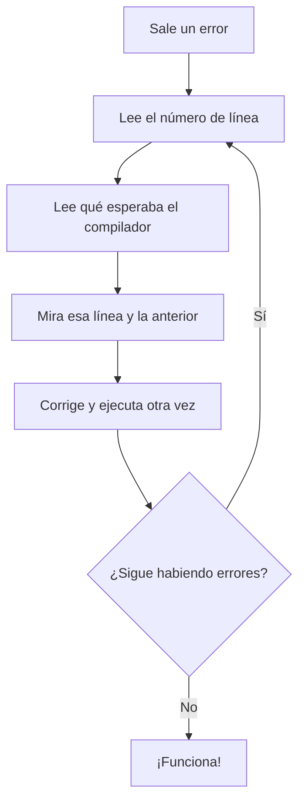

Vas a equivocarte muchas veces, y está bien: le pasa a todo el mundo, también a quien lleva años programando. Los mensajes de error no son una bronca; son el compilador diciéndote **qué esperaba y dónde**. Aprender a leerlos te ahorra horas.

> [!analogia]
> El compilador es como un corrector ortográfico muy estricto. Antes de dejarte "publicar" tu programa, lo revisa entero. Si encuentra una falta, no lo ejecuta y te subraya la línea con una explicación.

## Dos momentos, dos tipos de error

| Tipo | Cuándo | Quién lo detecta | ¿Se ejecuta algo? |
| --- | --- | --- | --- |
| **De compilación** | Al traducir el código | `javac` | No: el programa no llega a arrancar |
| **De ejecución** (excepciones) | Mientras el programa corre | La JVM | Sí, hasta el punto del error |

En esta lección te centras en los de compilación, los primeros que vas a ver. Los de ejecución llegan en la siguiente.

## Cómo se lee un error de compilación

```java error
public class Main {
    public static void main(String[] args) {
        System.out.println("Hola")
    }
}
```

Al ejecutar, la consola muestra:

```
Main.java:3: error: ';' expected
        System.out.println("Hola")
                                  ^
1 error
```

- `Main.java:3` → archivo y **línea** del problema (aquí, la 3).
- `error: ';' expected` → qué esperaba el compilador: un punto y coma.
- La flecha `^` señala la posición exacta donde se dio cuenta.

> [!prueba]
> Copia el ejemplo en el playground y ejecútalo para ver el error con tus propios ojos. Después añade el `;` que falta al final de la línea 3 y vuelve a ejecutar: el error desaparece.

## Los errores más comunes, en palabras sencillas

Los mensajes están en inglés. Aquí tienes los que más vas a ver, traducidos a lo que de verdad quieren decir:

| Mensaje | Lo que te está diciendo | Qué revisar |
| --- | --- | --- |
| `';' expected` | "Esperaba que terminaras la instrucción" | Falta el `;` al final de la línea (o justo antes) |
| `unclosed string literal` | "Abriste un texto con comillas y nunca lo cerraste" | Falta la `"` de cierre |
| `cannot find symbol` | "No sé qué es esta palabra" | Nombre mal escrito, una mayúscula distinta o una variable que no has creado |
| `package system does not exist` | "No conozco nada llamado `system`" | Casi siempre es `System` con mayúscula |
| `incompatible types` | "Esto no cabe en esa caja" | Guardas un texto donde va un número, o al revés |
| `reached end of file while parsing` | "Se acabó el archivo y aún faltaba algo" | Falta una llave `}` de cierre |
| `class X is public, should be declared in a file named X.java` | "El archivo y la clase no se llaman igual" | El nombre del archivo y el de la clase pública |

Mira tres de ellos en acción:

```java error
public class Main {
    public static void main(String[] args) {
        String nombre = "Ada";
        System.out.println(nombr);
    }
}
```

```
Main.java:4: error: cannot find symbol
        System.out.println(nombr);
                           ^
  symbol:   variable nombr
  location: class Main
```

`nombr` no existe: falta una `e`. La línea `symbol: variable nombr` te dice exactamente qué palabra no reconoce.

```java error
public class Main {
    public static void main(String[] args) {
        System.out.println("Hola);
    }
}
```

```
Main.java:3: error: unclosed string literal
```

El texto `"Hola` empieza con comillas pero no termina con ellas. Todo texto necesita su pareja de `"`.

```java error
public class Main {
    public static void main(String[] args) {
        int edad = "treinta";
    }
}
```

```
Main.java:3: error: incompatible types: String cannot be converted to int
```

En una caja para números enteros (`int`) no cabe un texto. Se arregla escribiendo `int edad = 30;`.

> [!cuidado]
> Un solo fallo (una llave que falta, una comilla sin cerrar) puede provocar varios mensajes en cascada. Corrige siempre **el primer error** de la lista y vuelve a ejecutar: muchas veces los demás desaparecen solos.

## Qué hacer cuando sale un error



> [!idea]
> Si en la línea indicada no ves nada raro, mira la línea **anterior**: un `;` o una `"` que falta al final de una línea se suele notar en la siguiente.

> [!resumen]
> - Un error de compilación impide que el programa arranque, pero te dice línea y motivo.
> - `';' expected`, `unclosed string literal`, `cannot find symbol` e `incompatible types` son los más frecuentes.
> - Corrige el primer error, vuelve a ejecutar y repite: cada error resuelto es un paso adelante.
