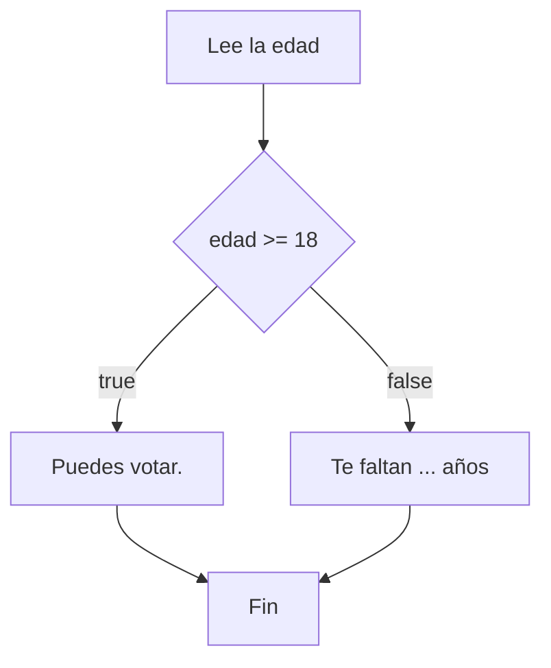

Hasta ahora tus programas ejecutaban todas sus líneas, siempre. Con `if` decides **qué** se ejecuta según una condición.

> [!analogia]
> Un `if` es como una bifurcación en un camino con un cartel: «si llueve, coge el paraguas». Según la respuesta a la pregunta, vas por un lado o por otro.

## if

```java
public class Main {
    public static void main(String[] args) {
        int temperatura = 32;
        if (temperatura > 30) {
            System.out.println("Hace calor, bebe agua.");
        }
        System.out.println("Fin del programa.");
    }
}
```

La condición va entre paréntesis y debe ser un `boolean`. Si es `true`, se ejecuta el bloque entre llaves; si es `false`, se salta.

> [!prueba]
> Cambia `int temperatura = 32;` por `int temperatura = 20;` y vuelve a ejecutar: ¿qué línea desaparece y cuál se imprime igualmente?

## else

`else` indica qué hacer cuando la condición es falsa. Siempre se ejecuta exactamente una de las dos ramas:



```java
import java.util.Scanner;

public class Main {
    public static void main(String[] args) {
        Scanner entrada = new Scanner(System.in);
        int edad = entrada.nextInt();
        if (edad >= 18) {
            System.out.println("Puedes votar.");
        } else {
            System.out.println("Te faltan " + (18 - edad) + " años para votar.");
        }
    }
}
```

> [!prueba]
> Ejecútalo con `18` en el panel de entrada y después con `15`: ¿qué rama se ejecuta cada vez?

## Las llaves

Si el bloque tiene una sola instrucción, Java permite omitir las llaves:

```java fragment
if (temperatura > 30) System.out.println("Calor");
```

Pero es una trampa conocida. Si más tarde añades una segunda línea con la misma sangría, **no** quedará dentro del `if`:

```java fragment
if (saldo < 0)
    System.out.println("Saldo negativo");
    bloquearCuenta();   // ¡se ejecuta siempre!
```

> [!cuidado]
> La sangría no decide qué está dentro del `if`: lo deciden las llaves. Pon siempre llaves, aunque el bloque tenga una sola línea.

## Condiciones compuestas

La condición puede ser cualquier expresión booleana, incluidas las combinaciones del módulo anterior:

```java
public class Main {
    public static void main(String[] args) {
        int hora = 14;
        boolean esFestivo = false;
        if (hora >= 9 && hora < 18 && !esFestivo) {
            System.out.println("Abierto");
        } else {
            System.out.println("Cerrado");
        }
    }
}
```

## Variables booleanas como condición

Si ya tienes un `boolean`, úsalo directamente. No hace falta compararlo con `true`:

```java fragment
boolean tieneDescuento = true;
if (tieneDescuento) { ... }          // bien
if (tieneDescuento == true) { ... }  // redundante
if (!tieneDescuento) { ... }         // en vez de == false
```

> [!cuidado]
> `if (edad = 18)` no compila: `=` asigna. Para comparar se usa `==`.

> [!resumen]
> - `if (condición) { ... }` ejecuta el bloque solo si la condición es `true`.
> - `else { ... }` cubre el caso contrario: se ejecuta exactamente una de las dos ramas.
> - Usa llaves siempre.
> - Una variable `boolean` ya es una condición: no la compares con `true`.
