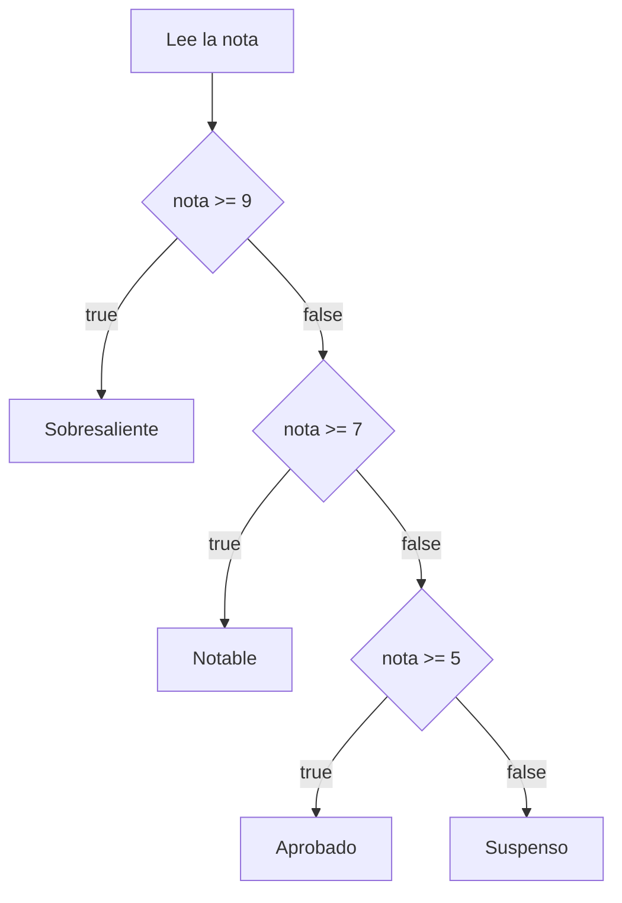

## else if

Cuando hay más de dos casos, encadena condiciones con `else if`. Java las comprueba **en orden** y ejecuta solo la primera que se cumple:

> [!analogia]
> Es como una fila de puertas con cartel. Pruebas la primera; si no es la tuya, pasas a la siguiente. En cuanto una se abre, entras y ya no miras las demás.



```java
import java.util.Scanner;

public class Main {
    public static void main(String[] args) {
        Scanner entrada = new Scanner(System.in);
        int nota = entrada.nextInt();
        if (nota >= 9) {
            System.out.println("Sobresaliente");
        } else if (nota >= 7) {
            System.out.println("Notable");
        } else if (nota >= 5) {
            System.out.println("Aprobado");
        } else {
            System.out.println("Suspenso");
        }
    }
}
```

Con `nota = 8`, la primera condición es falsa y la segunda verdadera: imprime `Notable` y **no** sigue comprobando, aunque `8 >= 5` también sea cierto.

> [!prueba]
> Ejecútalo con `8`, después con `5` y después con `2` en el panel de entrada: sigue el diagrama con el dedo y comprueba que coincide.

## El orden importa

Como gana la primera condición verdadera, ordénalas de la más restrictiva a la más general. Este código tiene un error lógico:

```java fragment
if (nota >= 5) {
    System.out.println("Aprobado");
} else if (nota >= 9) {          // nunca se alcanza
    System.out.println("Sobresaliente");
}
```

> [!cuidado]
> Un 10 imprimiría "Aprobado": la condición `nota >= 5` lo captura antes. Si una rama nunca se ejecuta, revisa el orden.

## Condiciones anidadas

Puedes poner un `if` dentro de otro:

> [!analogia]
> Anidar es como las muñecas rusas: abres una pregunta y, dentro, hay otra pregunta.

```java
public class Main {
    public static void main(String[] args) {
        boolean tieneCuenta = true;
        int saldo = 40;
        int precio = 55;
        if (tieneCuenta) {
            if (saldo >= precio) {
                System.out.println("Compra realizada.");
            } else {
                System.out.println("Saldo insuficiente.");
            }
        } else {
            System.out.println("Crea una cuenta primero.");
        }
    }
}
```

> [!prueba]
> Cambia `int saldo = 40;` por `int saldo = 60;` y vuelve a ejecutar. Luego pon `tieneCuenta = false`: ¿qué mensaje sale ahora?

Anidar está bien con uno o dos niveles. Más allá, el código se vuelve una escalera difícil de seguir.

## Aplanar con condiciones combinadas

Muchas veces un anidamiento se puede sustituir por una condición con `&&`:

```java fragment
// Anidado
if (edad >= 18) {
    if (tieneCarnet) {
        System.out.println("Puede conducir");
    }
}

// Plano: misma lógica, más legible
if (edad >= 18 && tieneCarnet) {
    System.out.println("Puede conducir");
}
```

## Validar primero

Un patrón muy útil: comprueba primero los casos inválidos y trata el caso normal al final.

```java
import java.util.Scanner;

public class Main {
    public static void main(String[] args) {
        Scanner entrada = new Scanner(System.in);
        int nota = entrada.nextInt();
        if (nota < 0 || nota > 10) {
            System.out.println("Nota no válida");
        } else if (nota >= 5) {
            System.out.println("Aprobado");
        } else {
            System.out.println("Suspenso");
        }
    }
}
```

> [!idea]
> Primero descarta lo raro, luego decide lo normal.

> [!resumen]
> - `else if` encadena casos; se ejecuta solo la primera rama verdadera.
> - Ordena las condiciones de la más específica a la más general.
> - Evita anidar más de dos niveles: combina condiciones con `&&` o valida primero.
