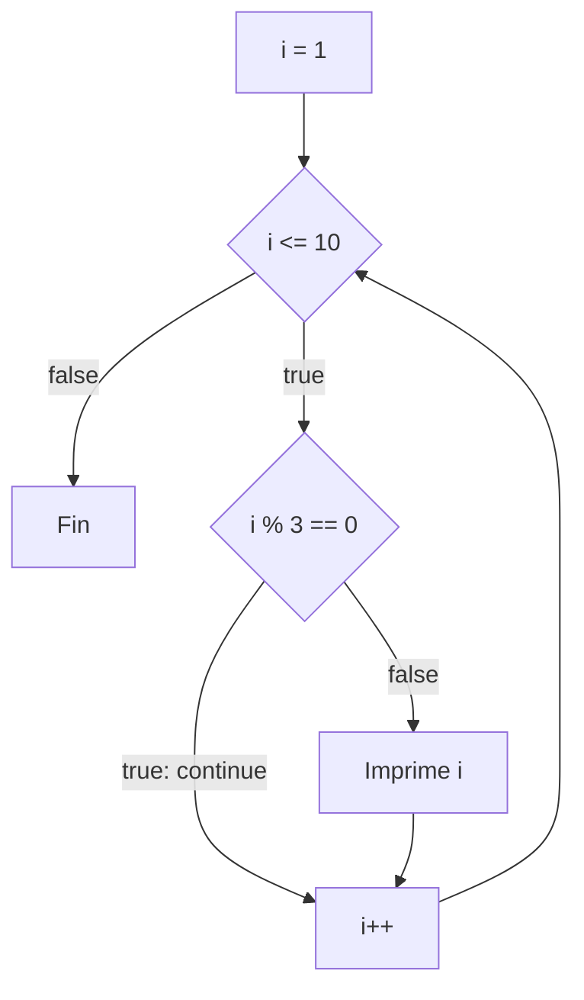

## break: salir del bucle

`break` termina el bucle inmediatamente, aunque la condición siga siendo verdadera. Es útil al **buscar**: en cuanto encuentras lo que buscas, no tiene sentido seguir.

> [!analogia]
> Buscas tus llaves cajón por cajón. En cuanto las encuentras, dejas de abrir cajones: eso es `break`.

```java
public class Main {
    public static void main(String[] args) {
        int buscado = 0;
        for (int i = 1; i <= 100; i++) {
            if (i * i > 500) {
                buscado = i;
                break;
            }
        }
        System.out.println("Primer número cuyo cuadrado pasa de 500: " + buscado);
    }
}
```

> [!prueba]
> Cambia `500` por `50` y vuelve a ejecutar: ¿en qué vuelta para ahora el bucle?

## continue: saltar a la siguiente vuelta

`continue` abandona la vuelta actual y pasa a la siguiente (en un `for`, ejecutando antes la actualización):

> [!analogia]
> Repartes folletos casa por casa y te saltas las que tienen el cartel «no publicidad»: no dejas de repartir, solo pasas a la siguiente puerta.



```java
public class Main {
    public static void main(String[] args) {
        for (int i = 1; i <= 10; i++) {
            if (i % 3 == 0) {
                continue;   // se salta los múltiplos de 3
            }
            System.out.print(i + " ");
        }
        System.out.println();
    }
}
```

Imprime `1 2 4 5 7 8 10`. Úsalo con moderación: muchas veces un `if` normal es más claro.

## Bucles anidados

Un bucle dentro de otro: por cada vuelta del exterior, el interior hace **todas** sus vueltas.

> [!analogia]
> Es como las agujas de un reloj: por cada vuelta de la aguja de las horas, la de los minutos da una vuelta completa.

```java
public class Main {
    public static void main(String[] args) {
        for (int fila = 1; fila <= 3; fila++) {
            for (int columna = 1; columna <= 4; columna++) {
                System.out.print(fila * columna + "\t");
            }
            System.out.println();
        }
    }
}
```

Salida:

```
1	2	3	4
2	4	6	8
3	6	9	12
```

El exterior controla las filas y el interior las columnas. Fíjate en el `println()` vacío tras el bucle interior: termina cada fila.

El interior puede depender del exterior. Así se dibuja un triángulo:

```java
public class Main {
    public static void main(String[] args) {
        for (int fila = 1; fila <= 4; fila++) {
            for (int i = 0; i < fila; i++) {
                System.out.print("*");
            }
            System.out.println();
        }
    }
}
```

> [!prueba]
> Cambia `fila <= 4` por `fila <= 6` y vuelve a ejecutar. Después cambia `"*"` por `fila` para ver qué fila dibuja cada línea.

> [!cuidado]
> Si el exterior da `n` vueltas y el interior otras `n`, el cuerpo se ejecuta `n × n` veces. Con `n = 1000` ya es un millón. Tenlo presente cuando trabajes con muchos datos.

## break en bucles anidados

`break` solo sale del bucle más interno. Para salir de todos a la vez puedes usar una **etiqueta** (un nombre que le pones al bucle):

```java
public class Main {
    public static void main(String[] args) {
        busqueda:
        for (int a = 1; a < 20; a++) {
            for (int b = a; b < 20; b++) {
                if (a * b == 91) {
                    System.out.println(a + " × " + b + " = 91");
                    break busqueda;
                }
            }
        }
    }
}
```

Si te ves necesitando etiquetas a menudo, suele ser señal de que ese código debería ir en un método propio (siguiente módulo) y salir con `return`.

> [!resumen]
> - `break` termina el bucle; `continue` salta a la siguiente vuelta.
> - En bucles anidados, el interior completa todas sus vueltas por cada vuelta del exterior.
> - `break` afecta solo al bucle más interno, salvo que uses una etiqueta.
