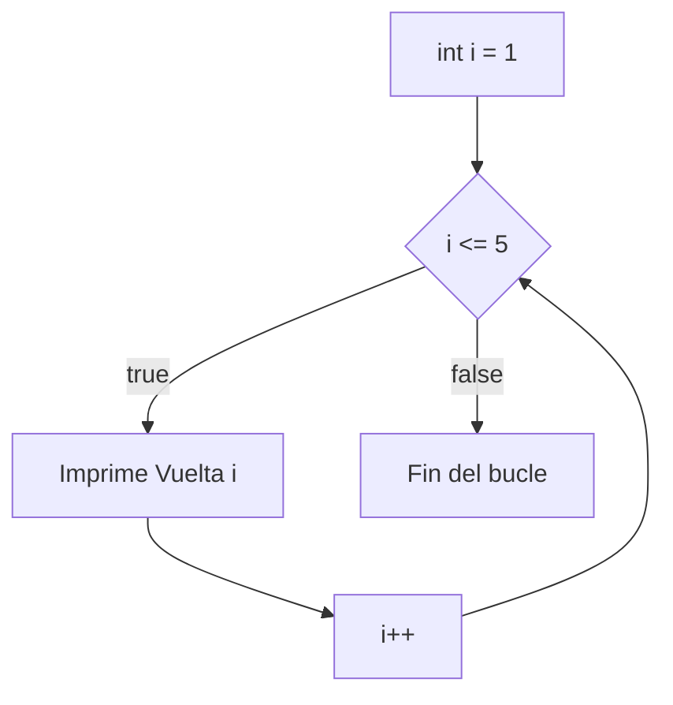

Cuando sabes cuántas veces quieres repetir, `for` reúne inicialización, condición y actualización en una sola línea.

> [!analogia]
> Un `for` es como hacer flexiones contando en voz alta: empiezas en 1, sigues mientras no llegues a 10, y en cada flexión sumas uno a la cuenta.

## Anatomía del for

```java
public class Main {
    public static void main(String[] args) {
        for (int i = 1; i <= 5; i++) {
            System.out.println("Vuelta " + i);
        }
    }
}
```

> [!prueba]
> Cambia `i <= 5` por `i < 5` y vuelve a ejecutar: ¿cuántas vueltas da ahora?

`for (inicialización; condición; actualización)`:

1. Se ejecuta la inicialización (`int i = 1`) una sola vez.
2. Se comprueba la condición (`i <= 5`). Si es falsa, el bucle termina.
3. Se ejecuta el bloque.
4. Se ejecuta la actualización (`i++`) y se vuelve al paso 2.



La variable `i` solo existe dentro del bucle.

## Contar de muchas formas

```java
public class Main {
    public static void main(String[] args) {
        for (int i = 0; i < 5; i++) {        // 0 1 2 3 4: 5 vueltas
            System.out.print(i + " ");
        }
        System.out.println();
        for (int i = 10; i >= 0; i -= 2) {   // 10 8 6 4 2 0
            System.out.print(i + " ");
        }
        System.out.println();
        for (char c = 'a'; c <= 'e'; c++) {  // a b c d e
            System.out.print(c + " ");
        }
        System.out.println();
    }
}
```

> [!idea]
> Para repetir `n` veces, cuenta de `0` a `n - 1` con `i < n`. Es la forma habitual y encaja con los arrays, cuyas posiciones empiezan en 0.

> [!cuidado]
> El error más típico con `for` es dar una vuelta de más o de menos (`<` en vez de `<=`, o empezar en 0 en vez de en 1). Si el resultado se queda corto o se pasa por uno, mira primero la condición.

## Acumuladores y contadores

Un patrón que usarás constantemente: una variable fuera del bucle que se va actualizando en cada vuelta.

> [!analogia]
> Un acumulador es como una hucha: empieza vacía y en cada vuelta echas algo. Un contador es como hacer palitos en una libreta cada vez que pasa algo.

```java
public class Main {
    public static void main(String[] args) {
        int suma = 0;
        int pares = 0;
        for (int i = 1; i <= 100; i++) {
            suma += i;
            if (i % 2 == 0) {
                pares++;
            }
        }
        System.out.println("Suma de 1 a 100: " + suma);
        System.out.println("Pares: " + pares);
    }
}
```

- **Acumulador** (`suma`): empieza en el elemento neutro (0 para sumar, 1 para multiplicar) y acumula.
- **Contador** (`pares`): empieza en 0 y suma 1 cada vez que algo ocurre.

Otro clásico es buscar el máximo: empieza con el primer valor y actualízalo cuando encuentres uno mayor.

> [!cuidado]
> Declara el acumulador **antes** del bucle. Si escribes `int suma = 0;` dentro, se vuelve a poner a 0 en cada vuelta.

## for o while

| Situación | Usa |
| --- | --- |
| Sabes cuántas vueltas: "10 veces", "de 1 a n" | `for` |
| Repites hasta que ocurra algo: "hasta que llegue un 0" | `while` |
| Al menos una vez y luego decides | `do-while` |

Cualquiera de los tres puede escribirse con los otros, pero elegir el adecuado hace el código más claro.

> [!resumen]
> - `for (init; condición; actualización)` agrupa las tres piezas del bucle.
> - Para `n` repeticiones: `for (int i = 0; i < n; i++)`.
> - Acumuladores y contadores se declaran **antes** del bucle.
