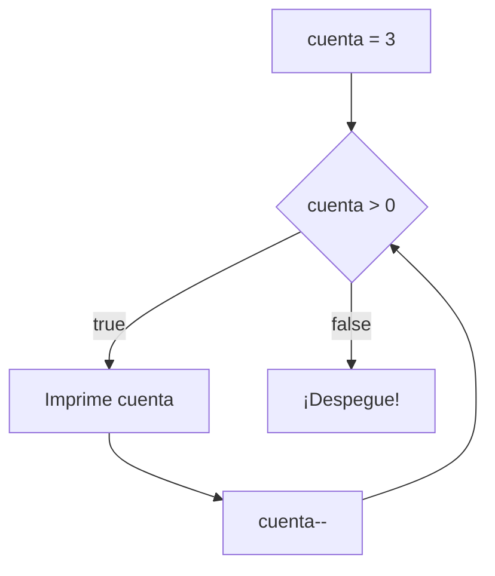

Un **bucle** repite un bloque de código. Es lo que permite a un programa procesar mil datos con las mismas líneas que usaría para uno.

> [!analogia]
> Un bucle es como dar vueltas a una pista de atletismo: repites el mismo recorrido hasta que se cumple la condición para parar («mientras no haya dado 10 vueltas, sigue corriendo»).

## while

`while` repite su bloque **mientras** la condición sea verdadera. La condición se comprueba antes de cada vuelta:



```java
public class Main {
    public static void main(String[] args) {
        int cuenta = 3;
        while (cuenta > 0) {
            System.out.println(cuenta + "...");
            cuenta--;
        }
        System.out.println("¡Despegue!");
    }
}
```

> [!prueba]
> Cambia `int cuenta = 3;` por `int cuenta = 10;` y vuelve a ejecutar. Luego prueba con `0`: ¿se ejecuta alguna vuelta?

Las tres piezas de casi cualquier bucle:

1. **Inicialización:** `int cuenta = 3;`
2. **Condición:** `cuenta > 0`
3. **Actualización:** `cuenta--;` (lo que acerca el bucle a su fin)

## Bucles infinitos

Si olvidas la actualización, la condición nunca cambia y el bucle no termina:

```java fragment
int i = 0;
while (i < 10) {
    System.out.println(i);   // falta i++: imprime 0 para siempre
}
```

> [!cuidado]
> Todo bucle necesita algo que lo acerque a su fin. En esta plataforma el programa se detiene al agotar el tiempo y verás **Tiempo agotado**. En tu ordenador tendrías que pararlo a mano (Ctrl + C).

## while para leer datos

`while` brilla cuando no sabes de antemano cuántas vueltas habrá. Por ejemplo, leer números hasta que llegue un 0:

```java
import java.util.Scanner;

public class Main {
    public static void main(String[] args) {
        Scanner entrada = new Scanner(System.in);
        int suma = 0;
        int numero = entrada.nextInt();
        while (numero != 0) {
            suma += numero;
            numero = entrada.nextInt();
        }
        System.out.println("Suma: " + suma);
    }
}
```

Con la entrada `5 3 2 0` imprime `Suma: 10`. Al número que marca el final (aquí el 0) se le llama **centinela**.

> [!analogia]
> El centinela es como la señal de «fin de la cola» en el súper: el cajero cobra un producto tras otro hasta que llega la barrita separadora.

También puedes leer hasta que se acabe la entrada con `hasNextInt()` o `hasNextLine()`:

```java
import java.util.Scanner;

public class Main {
    public static void main(String[] args) {
        Scanner entrada = new Scanner(System.in);
        int contador = 0;
        while (entrada.hasNextLine()) {
            String linea = entrada.nextLine();
            contador++;
            System.out.println(contador + ": " + linea);
        }
    }
}
```

## do-while

`do-while` comprueba la condición **al final**, así que el bloque se ejecuta al menos una vez:

> [!analogia]
> Es como probar un plato: primero lo pruebas y después decides si quieres repetir.

```java
public class Main {
    public static void main(String[] args) {
        int intentos = 0;
        do {
            intentos++;
            System.out.println("Intento " + intentos);
        } while (intentos < 3);
    }
}
```

Es útil para menús ("muestra el menú, y repite mientras no elija salir") o para pedir un dato hasta que sea válido.

> [!cuidado]
> El `do-while` termina con punto y coma tras el `while (...)`. Si lo olvidas, no compila.

> [!resumen]
> - `while (condición) { ... }` repite mientras la condición sea verdadera; puede no ejecutarse nunca.
> - `do { ... } while (condición);` se ejecuta al menos una vez.
> - Todo bucle necesita algo que lo acerque a su fin, o será infinito.
> - `while` es ideal cuando no sabes cuántas vueltas habrá: centinelas, `hasNext...`.
