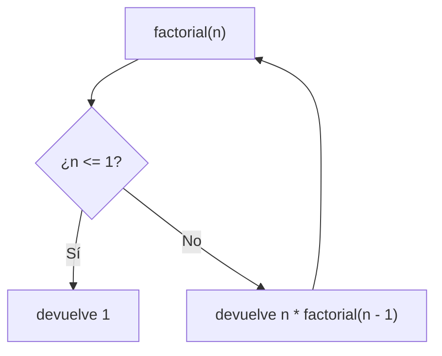

Un método **recursivo** es el que se llama a sí mismo. Suena raro, pero muchos problemas se describen de forma natural en términos de una versión más pequeña de sí mismos.

> [!analogia]
> Piensa en unas muñecas rusas: para llegar a la más pequeña abres una muñeca y dentro encuentras otra igual pero más pequeña. Repites lo mismo hasta que aparece una que ya no se abre. Esa última es el **caso base**.

## Un ejemplo: el factorial

El factorial de `n` (escrito `n!`) es `n × (n-1) × … × 1`. Fíjate en que `n! = n × (n-1)!`. Esa definición se traduce casi literalmente:

```java
public class Main {
    static long factorial(int n) {
        if (n <= 1) {
            return 1;                 // caso base
        }
        return n * factorial(n - 1);  // caso recursivo
    }

    public static void main(String[] args) {
        System.out.println(factorial(5));
        System.out.println(factorial(20));
    }
}
```

> [!prueba]
> Cambia `factorial(5)` por `factorial(6)` y ejecuta. ¿Sale 6 veces lo que salía antes?

Todo método recursivo tiene dos partes:

1. **Caso base:** una situación tan simple que se resuelve sin recursión (`n <= 1`).
2. **Caso recursivo:** resuelve el problema llamándose con una versión **más pequeña** (`n - 1`), que acabará llegando al caso base.



## Qué pasa al ejecutarlo

```
factorial(4)
= 4 * factorial(3)
= 4 * (3 * factorial(2))
= 4 * (3 * (2 * factorial(1)))
= 4 * (3 * (2 * 1))
= 24
```

Cada llamada queda en espera en la **pila de llamadas** hasta que la siguiente le devuelve su resultado. Justo cuando se llega al caso base de `factorial(4)`, la pila tiene un marco por llamada, cada uno con su propia `n`:

```memoria
stack main
stack factorial
n: 4
stack factorial
n: 3
stack factorial
n: 2
stack factorial
n: 1
```

> [!analogia]
> La pila de llamadas es como una pila de platos: cada llamada nueva pone un plato encima, y solo se puede quitar el de arriba. Cuando `factorial(1)` termina, se quita su plato y continúa `factorial(2)`.

## Si falta el caso base

Sin caso base, o si el problema no se hace más pequeño, el método se llama sin fin. Cada llamada ocupa espacio en la pila hasta que se agota:

```java error
static int infinito(int n) {
    return infinito(n + 1);   // nunca para
}
```

Resultado: `StackOverflowError`. Es el equivalente recursivo del bucle infinito.

> [!cuidado]
> Comprueba siempre dos cosas: que hay un caso base y que cada llamada se acerca a él. `factorial(n + 1)` en lugar de `factorial(n - 1)` nunca llegaría.

## Otro ejemplo: sumar las cifras

```java
public class Main {
    static int sumaDeCifras(int n) {
        if (n < 10) {
            return n;
        }
        return n % 10 + sumaDeCifras(n / 10);
    }

    public static void main(String[] args) {
        System.out.println(sumaDeCifras(4721));   // 4 + 7 + 2 + 1 = 14
    }
}
```

## Recursión o bucle

Todo lo recursivo se puede escribir con bucles, y al revés. Guíate por la claridad:

- **Recursión** cuando el problema tiene estructura recursiva: árboles, carpetas dentro de carpetas, dividir un problema en mitades (búsqueda binaria, ordenación).
- **Bucle** para recorridos lineales sencillos: suelen ser más rápidos y no arriesgan desbordar la pila.

El caso clásico de lo que **no** conviene es Fibonacci recursivo ingenuo: `fib(n) = fib(n-1) + fib(n-2)` recalcula los mismos valores una y otra vez, y con `n = 50` tarda una eternidad. Con un bucle es instantáneo; lo comprobarás en los ejercicios.

> [!resumen]
> - Un método recursivo se llama a sí mismo con un problema más pequeño.
> - Necesita un caso base que detenga la recursión; sin él, `StackOverflowError`.
> - Úsala cuando el problema es recursivo por naturaleza; para recorridos simples, un bucle.
