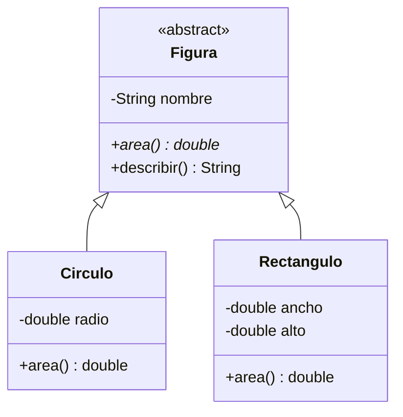

## Clases que no tienen sentido solas

¿Qué área tiene una "figura"? Ninguna en concreto: solo los círculos, rectángulos o triángulos tienen área. Una clase **abstracta** representa un concepto general que nunca se instancia directamente, solo a través de sus subclases.

> [!analogia]
> En una tienda no puedes comprar «una fruta» en general: compras manzanas, peras o plátanos. «Fruta» es una idea que agrupa lo común; las piezas reales son siempre de un tipo concreto. Una clase abstracta es esa idea general.

```java
abstract class Figura {
    private final String nombre;

    Figura(String nombre) {
        this.nombre = nombre;
    }

    abstract double area();          // sin cuerpo: cada subclase decide

    String describir() {             // método normal que usa el abstracto
        return String.format("%s de área %.2f", nombre, area());
    }
}

class Circulo extends Figura {
    private final double radio;

    Circulo(double radio) {
        super("Círculo");
        this.radio = radio;
    }

    @Override
    double area() {
        return Math.PI * radio * radio;
    }
}

class Rectangulo extends Figura {
    private final double ancho, alto;

    Rectangulo(double ancho, double alto) {
        super("Rectángulo");
        this.ancho = ancho;
        this.alto = alto;
    }

    @Override
    double area() {
        return ancho * alto;
    }
}

public class Main {
    public static void main(String[] args) {
        System.out.println(new Circulo(1).describir());
        System.out.println(new Rectangulo(2, 3.5).describir());
        // new Figura("x");  ← no compila: Figura es abstracta
    }
}
```

> [!prueba]
> Quita las barras `//` de la última línea del `main` y ejecuta: el compilador se queja de que `Figura` es abstracta. Vuelve a ponerlas y cambia `new Circulo(1)` por `new Circulo(2)`: el área se multiplica por cuatro.



En el diagrama, `<<abstract>>` marca la clase abstracta y el asterisco `*` marca el método abstracto.

- `abstract class` no se puede instanciar con `new`.
- Un **método abstracto** no tiene cuerpo (termina en `;`) y obliga a cada subclase concreta a implementarlo. Si una subclase no lo hace, también tiene que ser abstracta.
- Una clase abstracta **sí** puede tener campos, constructores y métodos normales.

> [!cuidado]
> Si una subclase olvida implementar un método abstracto, no compila: «Circulo is not abstract and does not override abstract method area()». El mensaje te dice exactamente qué método falta.

## El patrón plantilla

`describir()` es un **método plantilla**: fija los pasos generales y deja que las subclases rellenen el detalle (`area()`). Es una de las formas más útiles de la herencia: el algoritmo vive en un sitio y lo que varía, en las subclases.

> [!analogia]
> Es como un formulario con huecos: el texto fijo está impreso (`describir`) y cada persona rellena su hueco (`area`).

## protected

`protected` da acceso a las subclases (y al mismo paquete), pero no al resto:

```java fragment
abstract class Vehiculo {
    protected int velocidad;           // las subclases pueden leerla y cambiarla

    protected void acelerar(int incremento) {
        velocidad += incremento;
    }
}
```

Úsalo con mesura: un campo `protected` es una puerta abierta para todas las subclases, presentes y futuras. Muchas veces es mejor dejar el campo `private` y ofrecer métodos `protected`.

## ¿Abstracta o interfaz?

En el módulo de Interfaces verás otra forma de definir "lo que algo debe saber hacer". La diferencia principal:

- Una **clase abstracta** puede tener estado (campos) y constructores, pero solo se puede extender una.
- Una **interfaz** define capacidades sin estado, y una clase puede implementar muchas.

> [!resumen]
> - `abstract class` representa un concepto general que no se instancia.
> - Los métodos `abstract` no tienen cuerpo y obligan a las subclases a implementarlos.
> - El método plantilla fija el algoritmo y delega los detalles en las subclases.
> - `protected` abre acceso a las subclases; prefiere campos `private` con métodos `protected`.
