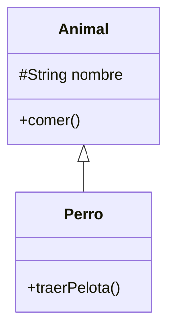
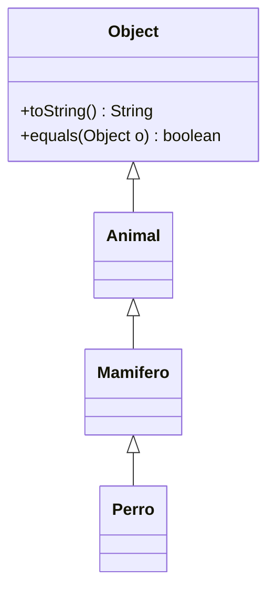

A veces una clase es una versión más específica de otra: un `Perro` es un `Animal`, un `Gerente` es un `Empleado`. La **herencia** permite escribir lo común una vez, en la clase general, y añadir solo lo nuevo en la específica.

> [!analogia]
> Piensa en una receta de bizcocho básico. El bizcocho de chocolate no se escribe desde cero: dice «haz el bizcocho básico y añade cacao». La receta de chocolate **hereda** todos los pasos de la básica y solo añade lo suyo.

## extends

```java
class Animal {
    protected String nombre;

    Animal(String nombre) {
        this.nombre = nombre;
    }

    void comer() {
        System.out.println(nombre + " está comiendo");
    }
}

class Perro extends Animal {
    Perro(String nombre) {
        super(nombre);
    }

    void traerPelota() {
        System.out.println(nombre + " trae la pelota");
    }
}

public class Main {
    public static void main(String[] args) {
        Perro toby = new Perro("Toby");
        toby.comer();        // heredado de Animal
        toby.traerPelota();  // propio de Perro
    }
}
```

> [!prueba]
> Añade a `Animal` un método `void dormir()` que imprima `nombre + " duerme"` y llama a `toby.dormir()` en el `main`. No has tocado `Perro`, y aun así el perro sabe dormir.

- `class Perro extends Animal` hace de `Perro` una **subclase** (o clase hija) de `Animal`, la **superclase** (o clase padre).
- `Perro` hereda los campos y métodos de `Animal` y puede añadir los suyos.
- En Java una clase solo puede extender **una** clase.

Así se dibuja esa relación. La flecha con punta hueca va de la hija al padre y se lee «es un»:



## super en el constructor

Los constructores no se heredan. El constructor de la subclase debe empezar llamando a uno de la superclase con `super(...)`, para que la parte "Animal" del objeto quede inicializada:

> [!analogia]
> Construir un `Gerente` es como montar una casa con ampliación: primero se levantan los cimientos y las paredes de la casa normal (`super(...)`), y solo después se añade la ampliación (`this.bonus = bonus`).

```java
class Empleado {
    private final String nombre;
    private final double sueldoBase;

    Empleado(String nombre, double sueldoBase) {
        this.nombre = nombre;
        this.sueldoBase = sueldoBase;
    }

    String getNombre() {
        return nombre;
    }

    double getSueldoBase() {
        return sueldoBase;
    }
}

class Gerente extends Empleado {
    private final double bonus;

    Gerente(String nombre, double sueldoBase, double bonus) {
        super(nombre, sueldoBase);   // primero, la parte de Empleado
        this.bonus = bonus;
    }

    double sueldoTotal() {
        return getSueldoBase() + bonus;
    }
}

public class Main {
    public static void main(String[] args) {
        Gerente g = new Gerente("Ada", 3000, 800);
        System.out.println(g.getNombre() + " cobra " + g.sueldoTotal());
    }
}
```

> [!cuidado]
> Si no escribes `super(...)`, Java intenta llamar a `super()` sin argumentos; si la superclase no tiene ese constructor, no compila. Y `super(...)` tiene que ser la **primera** línea del constructor.

Fíjate en que `Gerente` no puede leer `sueldoBase` directamente porque es `private` en `Empleado`: usa el getter. Lo privado no se hereda en el sentido de acceso.

## ¿Cuándo heredar?

Usa la prueba del **"es un"**: hereda solo si la frase "un B **es un** A" es cierta siempre.

- Un `Gerente` es un `Empleado` → herencia razonable.
- Un `Coche` **tiene un** `Motor` → no es herencia, es **composición**: un campo `private Motor motor;`.

> [!idea]
> **Prefiere la composición.** La herencia acopla mucho la subclase a la superclase: un cambio en el padre puede romper a los hijos. Si dudas, usa un campo.

## Jerarquías

Las subclases pueden tener a su vez subclases: `Animal → Mamifero → Perro`. Y toda clase de Java hereda, directa o indirectamente, de `Object`, que es la raíz de todas las jerarquías. De ahí vienen `toString`, `equals` y `hashCode`.



> [!resumen]
> - `class Hija extends Padre` hereda campos y métodos; solo se extiende una clase.
> - El constructor de la hija empieza con `super(...)`.
> - Hereda solo si "es un" se cumple siempre; si "tiene un", usa composición.
> - Toda clase desciende de `Object`.
