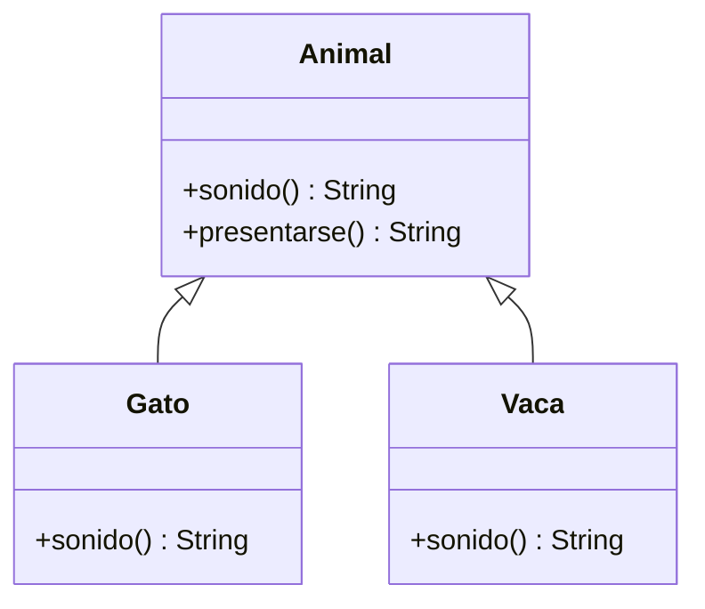

## Sobrescribir un método heredado

Una subclase puede dar **su propia versión** de un método que hereda. Se llama sobrescritura (*override*):

> [!analogia]
> En una familia todos heredan la receta de la abuela para la tortilla, pero tu tío la hace con cebolla. Cuando alguien le pide a tu tío «haz la tortilla», usa **su** versión, no la de la abuela. Eso es sobrescribir.

```java
class Animal {
    String sonido() {
        return "...";
    }

    String presentarse() {
        return "Hago " + sonido();
    }
}

class Gato extends Animal {
    @Override
    String sonido() {
        return "miau";
    }
}

class Vaca extends Animal {
    @Override
    String sonido() {
        return "muu";
    }
}

public class Main {
    public static void main(String[] args) {
        System.out.println(new Animal().presentarse());
        System.out.println(new Gato().presentarse());
        System.out.println(new Vaca().presentarse());
    }
}
```

> [!prueba]
> Borra el método `sonido()` de `Vaca` y vuelve a ejecutar: ¿qué dice ahora la vaca? Sin su propia versión, usa la heredada de `Animal`.

`presentarse` está escrito una sola vez en `Animal`, pero llama a la versión de `sonido` del objeto real. Esa es la puerta al polimorfismo (siguiente módulo).



Reglas de la sobrescritura:

- Mismo nombre y mismos parámetros que el método original.
- El tipo de retorno debe ser el mismo (o un subtipo).
- No puede ser **más** restrictivo en acceso: si el original es `public`, la versión nueva también.
- Usa siempre **`@Override`**: si te equivocas en el nombre o los parámetros, el compilador te avisa en lugar de crear un método nuevo sin que te des cuenta.

> [!cuidado]
> Sin `@Override`, escribir `String sonidos()` (con una «s» de más) no da error: crea un método **nuevo** y la versión del padre sigue usándose. Con `@Override`, el compilador te avisa al momento.

## Ampliar en vez de sustituir: super.metodo()

Con `super.metodo()` llamas a la versión de la superclase, para añadir algo en lugar de reescribirlo todo:

```java
class Producto {
    protected final String nombre;
    protected final double precio;

    Producto(String nombre, double precio) {
        this.nombre = nombre;
        this.precio = precio;
    }

    String descripcion() {
        return nombre + ": " + precio + " €";
    }
}

class ProductoEnOferta extends Producto {
    private final int descuento;

    ProductoEnOferta(String nombre, double precio, int descuento) {
        super(nombre, precio);
        this.descuento = descuento;
    }

    @Override
    String descripcion() {
        return super.descripcion() + " (-" + descuento + " %)";
    }
}

public class Main {
    public static void main(String[] args) {
        System.out.println(new Producto("Taza", 6).descripcion());
        System.out.println(new ProductoEnOferta("Libro", 20, 15).descripcion());
    }
}
```

## Sobrescribir los métodos de Object

Los métodos que más sobrescribirás son los que todo objeto hereda de `Object`: `toString`, `equals` y `hashCode` (los viste en el módulo de Objetos). Fíjate en que son `public`, así que tu versión también debe serlo.

## Impedir la sobrescritura: final

Un método `final` no puede sobrescribirse, y una clase `final` no puede tener subclases:

```java fragment
class Cuenta {
    final boolean retirar(double cantidad) { ... }   // las subclases no pueden cambiar esta regla
}

final class Dni { ... }   // nadie puede heredar de Dni
```

Útil para proteger reglas críticas o clases inmutables (como `String`, que es `final`).

## Sobrescribir no es sobrecargar

| | Sobrecarga | Sobrescritura |
| --- | --- | --- |
| Dónde | En la misma clase | En una subclase |
| Firma | Mismo nombre, **distintos** parámetros | Mismo nombre, **mismos** parámetros |
| Se decide | Al compilar, por los tipos de los argumentos | Al ejecutar, por el objeto real |

> [!idea]
> Cuando llamas a un método sobrescrito, manda el **objeto real**: se ejecuta la versión más específica que tenga.

> [!resumen]
> - Sobrescribir es redefinir en la subclase un método heredado con la misma firma.
> - Marca siempre `@Override`.
> - `super.metodo()` reutiliza la versión del padre.
> - `final` impide sobrescribir un método o heredar de una clase.
