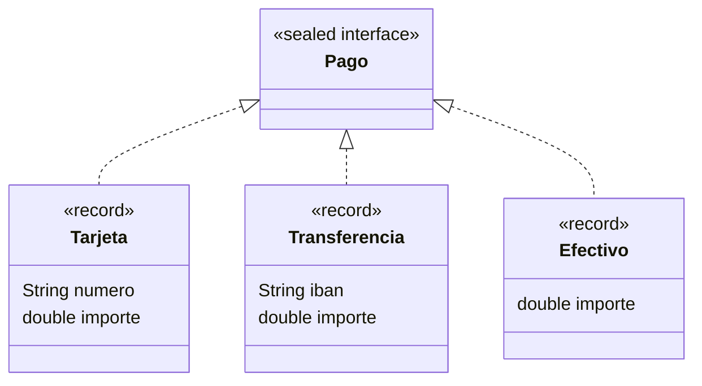

## Jerarquías cerradas

A veces sabes exactamente qué subclases puede tener un tipo: un pago es con tarjeta, transferencia o efectivo, y nada más. Desde Java 17, una clase o interfaz **sellada** (`sealed`) declara qué subtipos están permitidos:

> [!analogia]
> Es como una carta de restaurante con tres menús: el camarero sabe que solo le pueden pedir el 1, el 2 o el 3. Si la cocina se olvida de preparar uno, el encargado lo nota enseguida. Con una lista cerrada, se puede comprobar que no falta nada.



```java
sealed interface Pago permits Tarjeta, Transferencia, Efectivo {}

record Tarjeta(String numero, double importe) implements Pago {}
record Transferencia(String iban, double importe) implements Pago {}
record Efectivo(double importe) implements Pago {}

public class Main {
    static double comision(Pago pago) {
        return switch (pago) {
            case Tarjeta t -> t.importe() * 0.015;
            case Transferencia tr -> 0.35;
            case Efectivo e -> 0;
        };
    }

    public static void main(String[] args) {
        Pago[] pagos = {new Tarjeta("4111", 200), new Transferencia("ES12", 900), new Efectivo(20)};
        for (Pago p : pagos) {
            System.out.printf("%s -> comisión %.2f%n", p, comision(p));
        }
    }
}
```

(Ese `interface` es el tema del siguiente módulo; aquí basta con saber que define un tipo común. Los `record` los viste en Objetos.)

> [!prueba]
> Borra la línea `case Efectivo e -> 0;` y ejecuta. El compilador protesta porque el `switch` ya no cubre todos los pagos posibles. Vuelve a ponerla.

## switch con patrones

El `switch` del ejemplo no compara valores, sino **tipos**: `case Tarjeta t ->` entra si `pago` es una `Tarjeta` y la deja disponible como `t`.

Y como `Pago` está sellado, el compilador sabe que esos tres casos cubren todas las posibilidades: **no hace falta `default`**. Si mañana añades `Bizum` a la lista `permits` y te olvidas de tratarlo en el `switch`, el código deja de compilar y te señala exactamente dónde falta. Es una red de seguridad muy valiosa.

> [!idea]
> Sellar una jerarquía convierte el olvido de un caso en un error de compilación, en lugar de un fallo escondido.

## Patrones con condiciones

Puedes añadir una condición a un caso con `when`:

```java
sealed interface Figura permits Circulo, Cuadrado {}
record Circulo(double radio) implements Figura {}
record Cuadrado(double lado) implements Figura {}

public class Main {
    static String tamano(Figura f) {
        return switch (f) {
            case Circulo c when c.radio() > 10 -> "círculo grande";
            case Circulo c -> "círculo";
            case Cuadrado q when q.lado() > 10 -> "cuadrado grande";
            case Cuadrado q -> "cuadrado";
        };
    }

    public static void main(String[] args) {
        System.out.println(tamano(new Circulo(12)));
        System.out.println(tamano(new Cuadrado(3)));
    }
}
```

> [!cuidado]
> Los casos se comprueban en orden, así que el más específico va primero. Si pones `case Circulo c ->` antes que `case Circulo c when ...`, el segundo nunca podría ejecutarse y Java no lo compila.

## ¿Polimorfismo o switch con patrones?

Son dos formas de resolver el mismo problema:

| Métodos polimórficos | switch sobre tipos sellados |
| --- | --- |
| Fácil añadir **tipos** nuevos | Fácil añadir **operaciones** nuevas |
| Cada clase contiene su lógica | La lógica de una operación está junta |
| Ideal para comportamiento propio de cada tipo | Ideal para datos (records) procesados de varias formas |

> [!resumen]
> - `sealed ... permits A, B, C` limita los subtipos posibles.
> - `switch` con patrones elige según el tipo y extrae la variable: `case Tarjeta t ->`.
> - Con tipos sellados el compilador comprueba que cubres todos los casos, sin `default`.
> - `when` añade condiciones a un caso.
