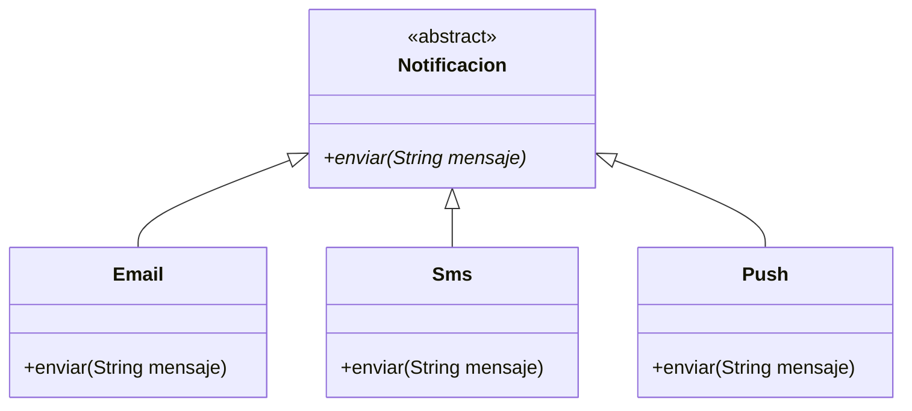

**Polimorfismo** significa "muchas formas": poder tratar objetos de clases distintas a través de un tipo común, y que cada uno responda a su manera.

> [!analogia]
> Un director de orquesta levanta la batuta y dice «¡tocad!». No le explica a cada músico cómo se toca su instrumento: el violín suena a violín y la trompeta a trompeta. Una sola orden, muchas respuestas distintas. Eso es el polimorfismo.

## Una variable del tipo padre

Una variable de tipo `Animal` puede guardar cualquier objeto que **sea** un `Animal`, incluidos perros y gatos:

```java
class Animal {
    String sonido() {
        return "...";
    }
}

class Perro extends Animal {
    @Override
    String sonido() {
        return "guau";
    }
}

class Gato extends Animal {
    @Override
    String sonido() {
        return "miau";
    }
}

public class Main {
    public static void main(String[] args) {
        Animal a = new Perro();     // un Perro visto como Animal
        System.out.println(a.sonido());   // guau, no "..."
        a = new Gato();
        System.out.println(a.sonido());   // miau
    }
}
```

> [!prueba]
> Añade al final del `main` las líneas `a = new Animal();` y `System.out.println(a.sonido());`. ¿Qué imprime ahora? La misma variable, tres objetos distintos, tres respuestas.

## Enlace dinámico

El tipo de la **variable** (`Animal`) decide qué métodos puedes llamar: solo los que tiene `Animal`. Pero el tipo del **objeto** (`Perro`, `Gato`) decide qué versión se ejecuta. Esa elección se hace en tiempo de ejecución y se llama **enlace dinámico**.

> [!analogia]
> La variable es la etiqueta del mando a distancia («mando de tele») y el objeto es la tele concreta. La etiqueta dice qué botones hay; la tele que tengas enchufada decide qué pasa al pulsarlos.

> [!cuidado]
> Si `Perro` tiene un método propio `traerPelota()`, `a.traerPelota()` **no compila** aunque `a` guarde un perro: la variable es de tipo `Animal` y `Animal` no tiene ese método.

## Por qué es tan útil

Permite escribir código general que funciona con tipos que ni siquiera existían cuando lo escribiste:



```java
abstract class Notificacion {
    abstract void enviar(String mensaje);
}

class Email extends Notificacion {
    @Override
    void enviar(String mensaje) {
        System.out.println("[email] " + mensaje);
    }
}

class Sms extends Notificacion {
    @Override
    void enviar(String mensaje) {
        System.out.println("[sms] " + mensaje.substring(0, Math.min(20, mensaje.length())));
    }
}

class Push extends Notificacion {
    @Override
    void enviar(String mensaje) {
        System.out.println("[push] " + mensaje.toUpperCase());
    }
}

public class Main {
    static void avisarATodos(Notificacion[] canales, String mensaje) {
        for (Notificacion canal : canales) {
            canal.enviar(mensaje);   // cada canal lo envía a su manera
        }
    }

    public static void main(String[] args) {
        Notificacion[] canales = {new Email(), new Sms(), new Push()};
        avisarATodos(canales, "Tu pedido ha salido del almacén");
    }
}
```

`avisarATodos` no sabe nada de emails ni SMS. Si mañana añades `Whatsapp extends Notificacion`, funciona sin tocarlo. Este es el principio **abierto/cerrado**: abierto a extensión, cerrado a modificación.

## Sustituye los if por objetos

Sin polimorfismo, el código anterior sería algo así:

```java fragment
if (tipo.equals("email")) { ... }
else if (tipo.equals("sms")) { ... }
else if (tipo.equals("push")) { ... }
```

repetido en cada sitio que dependa del tipo. Cuando veas una cadena de `if` sobre "qué clase de cosa es", piensa si cada caso debería ser una subclase con su propio método.

> [!idea]
> El tipo de la variable decide **qué** puedes pedir; el objeto real decide **cómo** se hace.

> [!resumen]
> - Una variable del tipo padre puede guardar objetos de cualquier subclase.
> - El tipo de la variable decide qué métodos puedes llamar; el del objeto, qué versión se ejecuta.
> - El polimorfismo permite código general que funciona con clases nuevas sin modificarlo.
