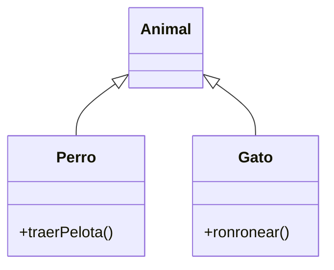

## Upcasting: de lo concreto a lo general

Asignar un objeto a una variable de su superclase es automático y siempre seguro:

```java fragment
Perro perro = new Perro();
Animal animal = perro;   // upcasting implícito
```

A través de `animal` ya no puedes llamar a los métodos propios de `Perro`, aunque el objeto siga siendo un perro.

> [!analogia]
> Meter un perro en una caja con la etiqueta «Animal» siempre es correcto: todo perro es un animal. Pero quien solo ve la etiqueta no sabe que dentro hay un perro, así que no le pedirá que traiga la pelota.



Subir por la flecha (de `Perro` a `Animal`) es upcasting; bajar (de `Animal` a `Perro`) es downcasting.

## Downcasting: de lo general a lo concreto

Para volver a usar los métodos específicos hay que convertir explícitamente, y solo funciona si el objeto **realmente** es de ese tipo:

```java
class Animal {}

class Perro extends Animal {
    void traerPelota() {
        System.out.println("¡Pelota!");
    }
}

class Gato extends Animal {}

public class Main {
    public static void main(String[] args) {
        Animal a = new Perro();
        Perro p = (Perro) a;      // bien: a es un Perro
        p.traerPelota();

        Animal b = new Gato();
        Perro q = (Perro) b;      // ClassCastException en ejecución
    }
}
```

> [!cuidado]
> El compilador acepta `(Perro) b` porque `b` *podría* ser un perro. El fallo llega al ejecutar: `ClassCastException`, porque en la caja hay un gato. Un cast no transforma el objeto, solo cambia la etiqueta con la que lo miras.

## instanceof

`instanceof` comprueba el tipo real antes de convertir. Desde Java 16, con **pattern matching**, la comprobación y la conversión van juntas:

> [!analogia]
> Es como abrir la caja y mirar antes de actuar: «si dentro hay un perro, le lanzo la pelota; si hay un gato, lo acaricio».

```java
class Animal {}

class Perro extends Animal {
    void traerPelota() {
        System.out.println("El perro trae la pelota");
    }
}

class Gato extends Animal {
    void ronronear() {
        System.out.println("El gato ronronea");
    }
}

public class Main {
    static void jugar(Animal animal) {
        if (animal instanceof Perro perro) {
            perro.traerPelota();
        } else if (animal instanceof Gato gato) {
            gato.ronronear();
        }
    }

    public static void main(String[] args) {
        jugar(new Perro());
        jugar(new Gato());
    }
}
```

> [!prueba]
> Añade al `main` la línea `jugar(new Animal());` y ejecuta. No imprime nada: un `Animal` genérico no es ni perro ni gato, así que no entra en ningún `if`.

`animal instanceof Perro perro` es `true` si el objeto es un `Perro` (o subclase) y, en ese caso, declara la variable `perro` ya convertida. `null instanceof Cualquiera` es siempre `false`.

## Un aviso de diseño

Si tu código está lleno de `instanceof`, probablemente se te ha escapado una oportunidad de polimorfismo: en vez de preguntar "¿eres un perro? ¿eres un gato?", añade un método en `Animal` y deja que cada subclase lo implemente. `instanceof` es razonable en `equals`, al procesar datos de fuera de tu control o con jerarquías selladas (siguiente lección).

> [!resumen]
> - Upcasting (hijo → padre) es automático; downcasting (padre → hijo) necesita `(Tipo)` y puede fallar.
> - `x instanceof Tipo t` comprueba y convierte en un solo paso.
> - Muchos `instanceof` suelen indicar que falta un método polimórfico.
