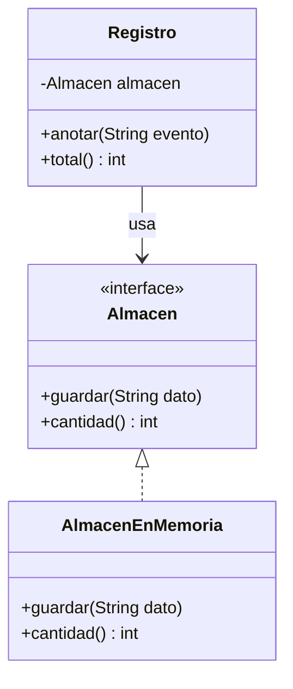

## Comparable: el orden natural

`Arrays.sort` sabe ordenar números y textos, pero ¿cómo ordena tus propios objetos? Tienes que decirle cuál va antes implementando `Comparable<T>`:

> [!analogia]
> Imagina que le pides a alguien que ordene una pila de fichas de alumnos. Lo primero que te preguntará es: «¿ordeno por nombre, por nota, por edad?». `compareTo` es tu respuesta: la regla para decidir, entre dos fichas, cuál va primero.

```java
import java.util.Arrays;

class Alumno implements Comparable<Alumno> {
    private final String nombre;
    private final double nota;

    Alumno(String nombre, double nota) {
        this.nombre = nombre;
        this.nota = nota;
    }

    @Override
    public int compareTo(Alumno otro) {
        return Double.compare(otro.nota, this.nota);   // de mayor a menor nota
    }

    @Override
    public String toString() {
        return nombre + " (" + nota + ")";
    }
}

public class Main {
    public static void main(String[] args) {
        Alumno[] clase = {new Alumno("Ada", 8.5), new Alumno("Alan", 9.7), new Alumno("Grace", 7.2)};
        Arrays.sort(clase);
        System.out.println(Arrays.toString(clase));
    }
}
```

> [!prueba]
> Cambia `Double.compare(otro.nota, this.nota)` por `Double.compare(this.nota, otro.nota)` y ejecuta. El orden se invierte: ahora va de menor a mayor nota.

`compareTo` devuelve:

- un número **negativo** si `this` va antes que `otro`,
- **cero** si son equivalentes,
- un número **positivo** si `this` va después.

> [!cuidado]
> Usa `Integer.compare`, `Double.compare` o `a.compareTo(b)` en vez de restar números: `a - b` puede desbordarse con números muy grandes y dar el signo equivocado.

## Comparator: otros órdenes

`Comparable` define **un** orden natural. Para ordenar de otras formas se usa un `Comparator`, que puedes crear al vuelo:

```java
import java.util.Arrays;
import java.util.Comparator;

record Producto(String nombre, double precio) {}

public class Main {
    public static void main(String[] args) {
        Producto[] productos = {
            new Producto("Taza", 6.0),
            new Producto("Libro", 18.5),
            new Producto("Lápiz", 0.9)
        };
        Arrays.sort(productos, Comparator.comparing(Producto::nombre));
        System.out.println(Arrays.toString(productos));
        Arrays.sort(productos, Comparator.comparingDouble(Producto::precio).reversed());
        System.out.println(Arrays.toString(productos));
    }
}
```

`Producto::nombre` es una **referencia a método**: "usa el método `nombre` de cada producto". Lo verás en el módulo de Lambdas.

## Programar contra interfaces

Un principio que guía el buen diseño: **depende de abstracciones, no de clases concretas**.

> [!analogia]
> Un cargador USB no está pensado para un móvil concreto, sino para «cualquier cosa con USB». Por eso sirve para tu móvil de hoy y para el que te compres el año que viene.



```java
interface Almacen {
    void guardar(String dato);
    int cantidad();
}

class AlmacenEnMemoria implements Almacen {
    private final StringBuilder datos = new StringBuilder();
    private int cuenta = 0;

    @Override
    public void guardar(String dato) {
        datos.append(dato).append('\n');
        cuenta++;
    }

    @Override
    public int cantidad() {
        return cuenta;
    }
}

class Registro {
    private final Almacen almacen;

    Registro(Almacen almacen) {          // recibe la interfaz, no la clase
        this.almacen = almacen;
    }

    void anotar(String evento) {
        almacen.guardar(java.time.LocalDate.of(2026, 10, 7) + " " + evento);
    }

    int total() {
        return almacen.cantidad();
    }
}

public class Main {
    public static void main(String[] args) {
        Registro registro = new Registro(new AlmacenEnMemoria());
        registro.anotar("inicio");
        registro.anotar("fin");
        System.out.println(registro.total() + " eventos");
    }
}
```

`Registro` funciona con cualquier `Almacen`: en memoria para pruebas, en un archivo o en una base de datos en producción, sin cambiar una línea. Pasar la dependencia por el constructor se llama **inyección de dependencias**, y es exactamente lo que hace Spring a gran escala.

> [!idea]
> Si una clase recibe una interfaz en lugar de una clase concreta, puedes cambiarle la pieza sin tocarla.

> [!resumen]
> - `Comparable<T>` y `compareTo` dan a tus objetos un orden natural para `Arrays.sort`.
> - `Comparator.comparing(...)` crea otros órdenes; `.reversed()` los invierte.
> - Recibe interfaces en lugar de clases concretas: el código queda desacoplado y fácil de probar.
