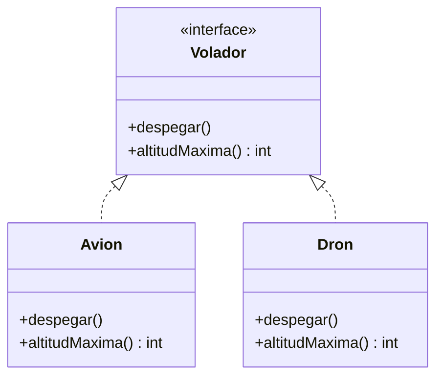
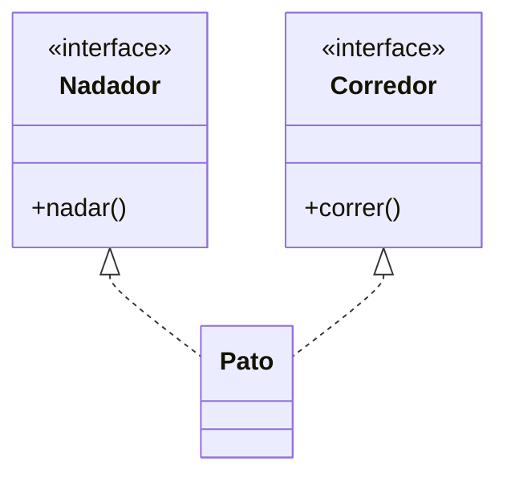

Una **interfaz** es un contrato: una lista de métodos que un tipo se compromete a ofrecer, sin decir cómo los implementa.

> [!analogia]
> Un enchufe es una interfaz: define la forma de la clavija y el voltaje, y nada más. Da igual que conectes una lámpara, un cargador o una tostadora: si respetan la forma del enchufe, funcionan. Al enchufe no le importa qué hay al otro lado.

## Declarar e implementar

```java
interface Volador {
    void despegar();
    int altitudMaxima();
}

class Avion implements Volador {
    @Override
    public void despegar() {
        System.out.println("El avión acelera por la pista");
    }

    @Override
    public int altitudMaxima() {
        return 12000;
    }
}

class Dron implements Volador {
    @Override
    public void despegar() {
        System.out.println("El dron se eleva en vertical");
    }

    @Override
    public int altitudMaxima() {
        return 120;
    }
}

public class Main {
    public static void main(String[] args) {
        Volador[] flota = {new Avion(), new Dron()};
        for (Volador v : flota) {
            v.despegar();
            System.out.println("  hasta " + v.altitudMaxima() + " m");
        }
    }
}
```

> [!prueba]
> Crea una clase `Globo implements Volador` que imprima `"El globo sube con aire caliente"` y llegue hasta 3000 m, y añádela al array `flota`. El bucle no cambia y el globo despega igual.

- `interface` declara los métodos sin cuerpo. Son implícitamente `public` y abstractos.
- `implements` compromete a la clase a implementarlos todos (con `public`).
- La interfaz es un **tipo**: `Volador v` puede guardar cualquier cosa que vuele, y el polimorfismo funciona igual que con la herencia.

En un diagrama, la flecha **discontinua** con punta hueca significa «implementa»:



> [!cuidado]
> Si olvidas el `public` al implementar un método de una interfaz, no compila: los métodos de la interfaz son públicos y tu versión no puede ser más restrictiva. El mensaje dirá algo como «attempting to assign weaker access privileges».

## Varias interfaces

Una clase solo puede extender una clase, pero puede implementar **todas las interfaces que quiera**:

```java
interface Nadador {
    void nadar();
}

interface Corredor {
    void correr();
}

class Pato implements Nadador, Corredor {
    @Override
    public void nadar() {
        System.out.println("El pato nada");
    }

    @Override
    public void correr() {
        System.out.println("El pato corre torpemente");
    }
}

public class Main {
    public static void main(String[] args) {
        Pato pato = new Pato();
        Nadador n = pato;
        Corredor c = pato;
        n.nadar();
        c.correr();
    }
}
```

Es la forma de expresar que un objeto tiene **varias capacidades** independientes.

> [!analogia]
> Una persona puede tener a la vez el carné de conducir, el de socorrista y el de manipulador de alimentos. Cada carné es un contrato distinto, y tenerlos todos no es ningún problema.



## Interfaces o clases abstractas

| Interfaz | Clase abstracta |
| --- | --- |
| Describe una **capacidad** ("puede volar", "es comparable") | Describe **qué es** algo ("es una figura") |
| Sin estado (sin campos de instancia) | Puede tener campos y constructores |
| Una clase implementa muchas | Una clase extiende solo una |

En la duda, empieza por una interfaz: es lo más flexible.

## Las interfaces de Java que ya usas

La biblioteca estándar está llena de interfaces: `List`, `Map` y `Set` (módulo de Collections), `Comparable` (en esta lección), `Runnable` (Concurrencia), `AutoCloseable` (Archivos)… Cuando escribas `List<String> nombres = new ArrayList<>();`, estarás programando contra la interfaz `List` y no contra la clase concreta.

> [!resumen]
> - Una interfaz declara métodos que los tipos que la implementan deben ofrecer.
> - `class X implements A, B` puede implementar varias interfaces.
> - Las interfaces son tipos y permiten polimorfismo.
> - Interfaz para capacidades; clase abstracta para una base con estado común.
