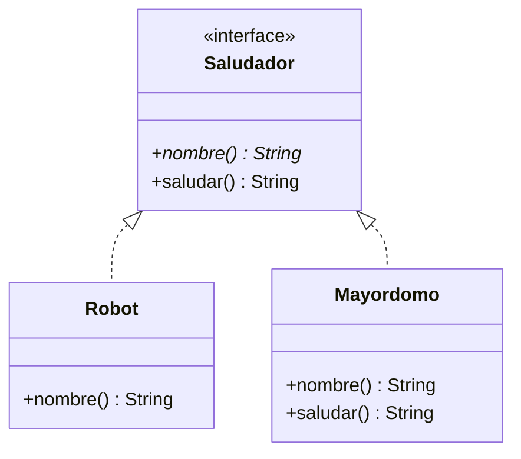

## Métodos default

Desde Java 8 una interfaz puede incluir métodos **con cuerpo**, marcados con `default`. Las clases que la implementan los heredan y pueden sobrescribirlos si quieren:

> [!analogia]
> Es como un contrato de alquiler que trae una cláusula ya redactada: «la limpieza la hace el inquilino». Si no dices nada, se aplica tal cual. Si lo pactas de otra forma, tu versión la sustituye.

```java
interface Saludador {
    String nombre();

    default String saludar() {
        return "Hola, soy " + nombre();
    }
}

class Robot implements Saludador {
    @Override
    public String nombre() {
        return "R2";
    }
}

class Mayordomo implements Saludador {
    @Override
    public String nombre() {
        return "Alfred";
    }

    @Override
    public String saludar() {
        return "Buenas tardes, señor. Soy " + nombre() + ".";
    }
}

public class Main {
    public static void main(String[] args) {
        System.out.println(new Robot().saludar());
        System.out.println(new Mayordomo().saludar());
    }
}
```

> [!prueba]
> Borra el método `saludar()` de `Mayordomo` y vuelve a ejecutar: ahora Alfred saluda como el robot, con la versión `default` de la interfaz.



Los métodos `default` se inventaron para poder **ampliar** interfaces existentes sin romper las clases que ya las implementaban. Por ejemplo, `List` ganó `forEach` y `removeIf` así. Úsalos para comportamiento que se pueda expresar a partir de los métodos abstractos de la interfaz.

> [!cuidado]
> Un método `default` no puede usar campos de la clase, porque la interfaz no los conoce. Solo puede apoyarse en otros métodos de la interfaz, como hace `saludar()` con `nombre()`.

## Métodos static

Una interfaz también puede tener métodos `static`, que se llaman con el nombre de la interfaz. Son útiles como métodos de fábrica o utilidades relacionadas:

```java
interface Moneda {
    double enEuros();

    static Moneda euros(double cantidad) {
        return () -> cantidad;
    }

    static Moneda dolares(double cantidad) {
        return () -> cantidad * 0.92;
    }
}

public class Main {
    public static void main(String[] args) {
        Moneda a = Moneda.euros(10);
        Moneda b = Moneda.dolares(10);
        System.out.printf("%.2f %.2f%n", a.enEuros(), b.enEuros());
    }
}
```

Ese `() -> cantidad` es una **lambda**: una forma compacta de implementar una interfaz con un solo método abstracto. Las verás a fondo en su módulo.

## Constantes en interfaces

Los campos de una interfaz son siempre `public static final`. Se pueden usar para constantes, aunque normalmente es más claro ponerlas en la clase que las usa o en un `enum`.

## Interfaces funcionales

Una interfaz con **un solo** método abstracto se llama **funcional** y puede implementarse con una lambda. Puedes marcarla con `@FunctionalInterface` para que el compilador lo compruebe:

> [!analogia]
> Una interfaz funcional es como un hueco con forma de una sola pieza: cualquier pieza que encaje vale, y una lambda es la forma más rápida de fabricarla.

```java
@FunctionalInterface
interface Operacion {
    int aplicar(int a, int b);
}

public class Main {
    public static void main(String[] args) {
        Operacion suma = (a, b) -> a + b;
        Operacion potencia = (a, b) -> (int) Math.pow(a, b);
        System.out.println(suma.aplicar(3, 4));
        System.out.println(potencia.aplicar(2, 8));
    }
}
```

> [!resumen]
> - `default` añade métodos con cuerpo que las clases heredan y pueden sobrescribir.
> - `static` en una interfaz da utilidades y fábricas: `Moneda.euros(10)`.
> - Una interfaz con un solo método abstracto es funcional y se implementa con una lambda.
