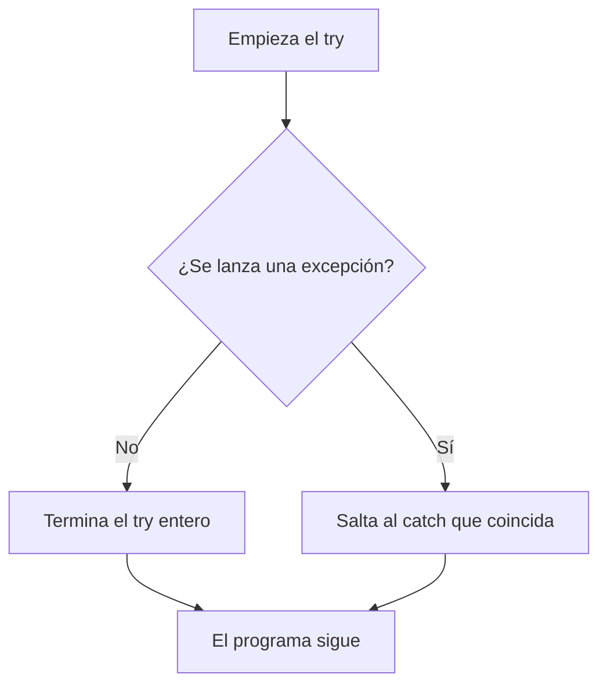

Hasta ahora, si algo salía mal (dividir entre cero, convertir `"hola"` en número, salirte de un array), el programa se paraba de golpe con un mensaje rojo. Eso es una **excepción**: un aviso de que algo ha ido mal que interrumpe el flujo normal del programa. Si nadie la trata, el programa termina mostrando una traza de error. Con `try`/`catch` puedes **capturarla** y reaccionar.

> [!analogia]
> Piensa en un trapecista con red. El `try` es el número arriesgado; el `catch` es la red de seguridad. Si el trapecista cae (se lanza una excepción), la red lo recoge y el espectáculo continúa. Sin red, la caída termina la función.

## Capturar una excepción

```java
public class Main {
    public static void main(String[] args) {
        String[] entradas = {"42", "hola", "7"};
        for (String texto : entradas) {
            try {
                int numero = Integer.parseInt(texto);
                System.out.println("Doble: " + numero * 2);
            } catch (NumberFormatException e) {
                System.out.println("'" + texto + "' no es un número");
            }
        }
        System.out.println("El programa sigue");
    }
}
```

- El código que puede fallar va en el bloque `try`.
- Si se lanza una excepción, la ejecución **salta** al `catch` cuyo tipo coincida; el resto del `try` no se ejecuta.
- Después del `catch`, el programa continúa con normalidad.
- Si no hay excepción, el `catch` se ignora.



> [!prueba]
> Cambia `"hola"` por `"3.5"` y vuelve a ejecutar: ¿qué pasa? `parseInt` solo acepta enteros, así que `3.5` también acaba en el `catch`. Fíjate en que «Doble:» nunca se imprime para ese texto.

## El objeto excepción

La variable del `catch` (`e`) es un objeto con información sobre el error:

```java
public class Main {
    public static void main(String[] args) {
        try {
            int[] datos = new int[3];
            datos[5] = 1;
        } catch (ArrayIndexOutOfBoundsException e) {
            System.out.println("Mensaje: " + e.getMessage());
            System.out.println("Tipo: " + e.getClass().getSimpleName());
        }
    }
}
```

`e.printStackTrace()` imprime la traza completa, útil para depurar.

> [!prueba]
> Cambia `datos[5]` por `datos[2]` y ejecuta: no se imprime nada, porque la posición 2 existe y el `catch` no llega a usarse.

## Varios catch

Un `try` puede tener varios `catch`, que se comprueban en orden:

```java
import java.util.Scanner;

public class Main {
    public static void main(String[] args) {
        Scanner entrada = new Scanner(System.in);
        try {
            int a = Integer.parseInt(entrada.nextLine().trim());
            int b = Integer.parseInt(entrada.nextLine().trim());
            System.out.println(a / b);
        } catch (NumberFormatException e) {
            System.out.println("Escribe números enteros");
        } catch (ArithmeticException e) {
            System.out.println("No se puede dividir entre cero");
        }
    }
}
```

Si dos tipos se tratan igual, puedes unirlos: `catch (NumberFormatException | ArithmeticException e)`.

> [!cuidado]
> Pon los tipos más específicos antes que los generales. Un `catch (Exception e)` primero capturaría todo y los siguientes nunca se alcanzarían (de hecho, el compilador no lo permite).

## Lo que no hay que hacer

```java fragment
try {
    procesar();
} catch (Exception e) {
    // vacío: el error desaparece en silencio
}
```

Un `catch` vacío esconde los errores: el programa sigue como si nada y falla más tarde, lejos de la causa real. Si capturas, **haz algo**: informa, usa un valor alternativo, reintenta o vuelve a lanzar.

Tampoco uses excepciones para el flujo normal. Si puedes comprobar algo antes (`if (divisor != 0)`), hazlo: es más claro y más rápido.

> [!idea]
> Captura una excepción solo cuando sepas qué hacer con ella.

> [!resumen]
> - `try { ... } catch (Tipo e) { ... }` captura la excepción y deja continuar el programa.
> - Al lanzarse, el resto del `try` se salta y se ejecuta el `catch` que coincida.
> - Varios `catch`, de lo más específico a lo más general; `|` para tratar varios igual.
> - Nunca dejes un `catch` vacío.
