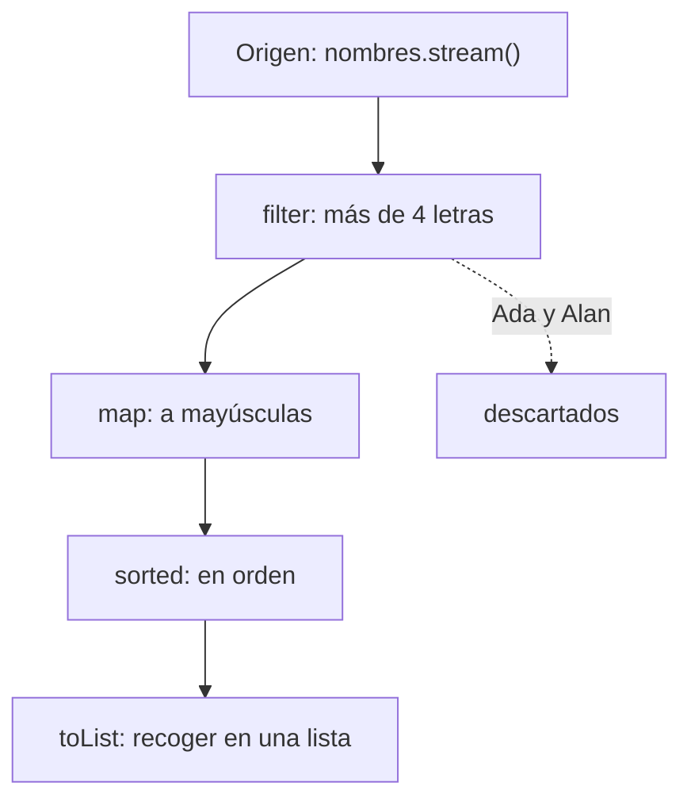

Un **stream** es una secuencia de elementos sobre la que encadenas operaciones: filtrar, transformar, ordenar, resumir. En lugar de escribir el bucle, describes **qué** quieres obtener.

> [!analogia]
> Un stream es una cinta transportadora de fábrica. Los elementos entran por un extremo, pasan por estaciones (una quita los defectuosos, otra los pinta, otra los ordena) y al final alguien los mete en una caja. Tú solo decides qué estaciones pones y en qué orden.

## Bucle frente a stream

"Los nombres de más de 4 letras, en mayúsculas y ordenados":

```java
import java.util.ArrayList;
import java.util.Collections;
import java.util.List;

public class Main {
    public static void main(String[] args) {
        List<String> nombres = List.of("Ada", "Grace", "Linus", "Alan", "Barbara");

        // Con un bucle
        List<String> resultado = new ArrayList<>();
        for (String nombre : nombres) {
            if (nombre.length() > 4) {
                resultado.add(nombre.toUpperCase());
            }
        }
        Collections.sort(resultado);
        System.out.println(resultado);

        // Con un stream
        List<String> conStream = nombres.stream()
            .filter(nombre -> nombre.length() > 4)
            .map(String::toUpperCase)
            .sorted()
            .toList();
        System.out.println(conStream);
    }
}
```

El stream se lee de arriba abajo como una receta: filtra, transforma, ordena, convierte en lista.

> [!prueba]
> En la versión con stream, cambia `nombre.length() > 4` por `nombre.startsWith("A")` y ejecuta: ¿qué nombres salen ahora en la segunda línea?

## Las tres partes

1. **Origen:** de dónde salen los elementos. `lista.stream()`, `Arrays.stream(array)`, `Stream.of(a, b, c)`, `IntStream.range(0, 10)`.
2. **Operaciones intermedias:** devuelven otro stream y se pueden encadenar (`filter`, `map`, `sorted`, `distinct`, `limit`…).
3. **Operación terminal:** produce el resultado y cierra el stream (`toList`, `count`, `forEach`, `collect`, `sum`…).

Así viaja el ejemplo anterior por la cinta:



## Propiedades importantes

- **No modifica el origen.** `nombres` sigue igual; el stream produce algo nuevo.
- **Es perezoso.** Las operaciones intermedias no hacen nada hasta que llega la terminal. Gracias a eso, `filter(...).findFirst()` se detiene en cuanto encuentra el primero.
- **Se consume una sola vez.** Después de la operación terminal no puedes reutilizar el mismo stream: crea otro.

> [!analogia]
> "Perezoso" significa que la cinta no arranca hasta que alguien espera la caja al final. Puedes montar todas las estaciones que quieras: sin operación terminal, no pasa nada.

```java
import java.util.stream.Stream;

public class Main {
    public static void main(String[] args) {
        Stream<String> s = Stream.of("a", "b", "c");
        System.out.println(s.count());
        // s.count();   ← IllegalStateException: stream has already been operated upon
    }
}
```

> [!cuidado]
> Un stream sin operación terminal no hace nada: `nombres.stream().filter(...).map(...);` no imprime ni guarda nada. Termina siempre con `toList()`, `forEach(...)`, `count()` u otra terminal.

## Orígenes útiles

```java
import java.util.Arrays;
import java.util.stream.IntStream;
import java.util.stream.Stream;

public class Main {
    public static void main(String[] args) {
        int[] notas = {7, 4, 9};
        System.out.println(Arrays.stream(notas).sum());
        System.out.println(IntStream.rangeClosed(1, 5).sum());              // 1+2+3+4+5
        System.out.println(Stream.of("x", "y", "z").toList());
        System.out.println(Stream.iterate(1, n -> n * 2).limit(8).toList()); // potencias de 2
        System.out.println("hola mundo".chars().filter(c -> c == 'o').count());
    }
}
```

## ¿Cuándo usar streams?

Son ideales para **transformar y resumir colecciones**. Para lógica con muchos pasos que dependen unos de otros, efectos secundarios o salidas tempranas complejas, un bucle normal puede ser más claro. No es una competición: elige lo que se lea mejor.

> [!idea]
> Con un bucle dices *cómo* recorrer; con un stream dices *qué* quieres obtener.

> [!resumen]
> - Un stream encadena origen → operaciones intermedias → operación terminal.
> - No modifica la colección original, es perezoso y solo se consume una vez.
> - `toList()` es la terminal más habitual para obtener una lista.
