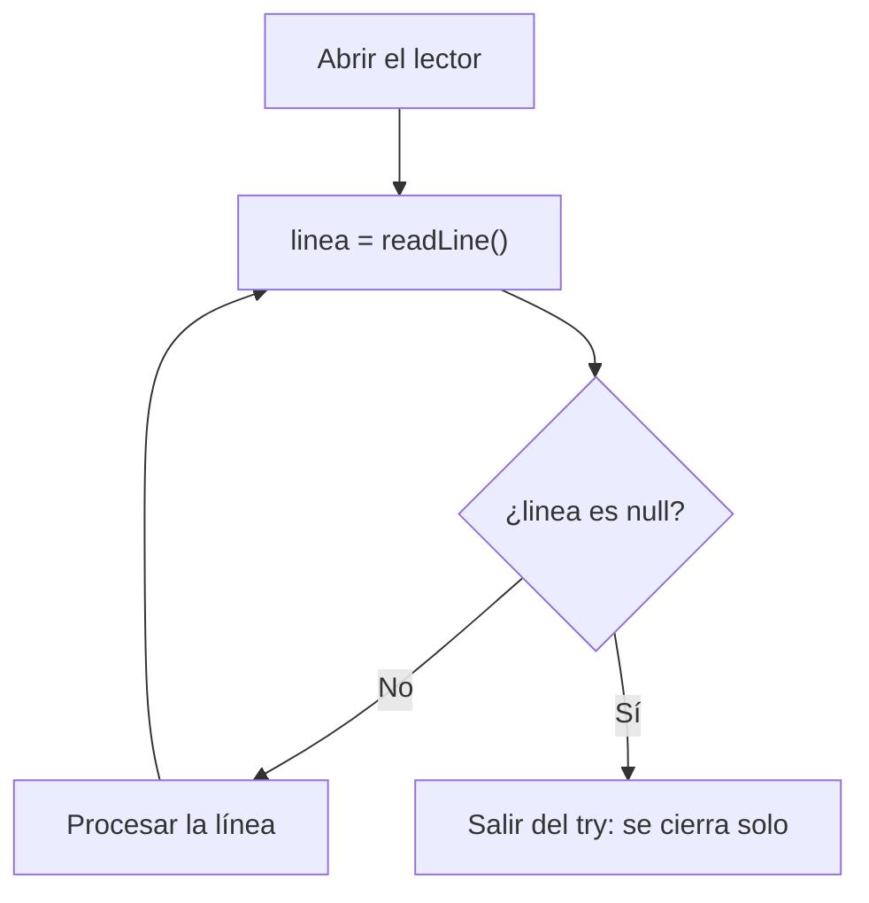

`readAllLines` carga el archivo entero en memoria. Con un archivo de varios gigas, el programa se quedaría sin memoria. Para archivos grandes se lee **línea a línea**, con un lector que hay que **cerrar** al terminar.

## Recursos que hay que cerrar

Lectores, escritores, conexiones de red o de base de datos son **recursos**: ocupan algo del sistema operativo (un descriptor de archivo, un socket) que hay que liberar. Si no los cierras, el programa acaba agotándolos.

> [!analogia]
> Un recurso es como un grifo: lo abres para usarlo y, si se te olvida cerrarlo, el agua se sigue gastando aunque ya no la necesites. Si dejas muchos grifos abiertos, el depósito se vacía.

## try-with-resources

Los recursos declarados entre paréntesis tras `try` se cierran **automáticamente** al salir del bloque, termine bien o con una excepción:

> [!analogia]
> try-with-resources es un grifo con temporizador: cuando sales del baño, se cierra solo, tanto si sales tranquilamente como si sales corriendo.

```java
import java.io.BufferedReader;
import java.io.BufferedWriter;
import java.io.IOException;
import java.nio.file.Files;
import java.nio.file.Path;

public class Main {
    public static void main(String[] args) throws IOException {
        Path archivo = Path.of("numeros.txt");
        try (BufferedWriter escritor = Files.newBufferedWriter(archivo)) {
            for (int i = 1; i <= 5; i++) {
                escritor.write("línea " + i);
                escritor.newLine();
            }
        }

        try (BufferedReader lector = Files.newBufferedReader(archivo)) {
            String linea;
            int numero = 0;
            while ((linea = lector.readLine()) != null) {
                numero++;
                System.out.println(numero + ": " + linea);
            }
        }
    }
}
```

> [!prueba]
> Cambia `i <= 5` por `i <= 3` y ejecuta: ¿cuántas líneas lee ahora el bucle `while`?

- `readLine()` devuelve la siguiente línea, o `null` al llegar al final.
- La condición `(linea = lector.readLine()) != null` lee y comprueba a la vez: es el patrón clásico.
- No hay `close()` en ninguna parte: lo hace el `try`.

Así funciona el bucle de lectura:



Puedes declarar varios recursos separados por `;` y se cierran en orden inverso.

## Lo que había antes

Sin try-with-resources, había que cerrar en un `finally`, con cuidado de no fallar si el recurso era `null`:

```java fragment
BufferedReader lector = null;
try {
    lector = Files.newBufferedReader(archivo);
    // ...
} finally {
    if (lector != null) {
        lector.close();
    }
}
```

Más largo y fácil de equivocar. Usa siempre try-with-resources.

## Funciona con tus clases

Cualquier clase que implemente `AutoCloseable` puede usarse en un try-with-resources:

```java
class Conexion implements AutoCloseable {
    Conexion() {
        System.out.println("Conexión abierta");
    }

    void enviar(String dato) {
        System.out.println("Enviando " + dato);
    }

    @Override
    public void close() {
        System.out.println("Conexión cerrada");
    }
}

public class Main {
    public static void main(String[] args) {
        try (Conexion conexion = new Conexion()) {
            conexion.enviar("hola");
            throw new IllegalStateException("algo falló");
        } catch (IllegalStateException e) {
            System.out.println("Error: " + e.getMessage());
        }
    }
}
```

Fíjate en el orden de la salida: la conexión se cierra **antes** de entrar al `catch`.

## Streams de líneas

`Files.lines` combina lo mejor de ambos mundos: lee perezosamente y permite usar la API de streams. También es un recurso:

```java
import java.io.IOException;
import java.nio.file.Files;
import java.nio.file.Path;
import java.util.List;
import java.util.stream.Stream;

public class Main {
    public static void main(String[] args) throws IOException {
        Path archivo = Path.of("datos.txt");
        Files.write(archivo, List.of("10", "x", "25", "7"));
        try (Stream<String> lineas = Files.lines(archivo)) {
            int suma = lineas.filter(l -> l.matches("-?\\d+")).mapToInt(Integer::parseInt).sum();
            System.out.println("Suma: " + suma);
        }
    }
}
```

> [!cuidado]
> El recurso solo existe dentro del bloque `try`. Si intentas usar `lector` o `lineas` después de la llave de cierre, no compila: ya está cerrado y fuera de alcance. Guarda en una variable de fuera lo que necesites (una suma, una lista).

> [!resumen]
> - Los recursos (lectores, escritores, conexiones) deben cerrarse siempre.
> - `try (Recurso r = ...) { }` los cierra automáticamente, incluso si hay excepción.
> - `BufferedReader.readLine()` lee línea a línea hasta devolver `null`.
> - `Files.lines` da un stream de líneas; ciérralo con try-with-resources.
