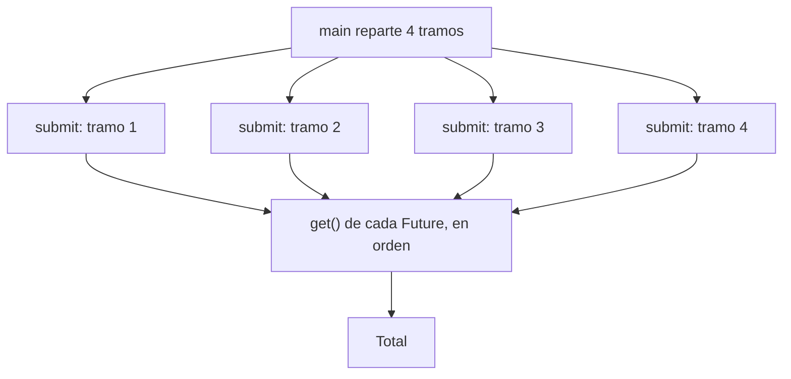

Crear hilos a mano es de bajo nivel: hay que gestionarlos, esperarlos y recoger sus resultados. En la práctica se usa un **ejecutor**: un servicio que mantiene un grupo de hilos (*pool*) y les reparte tareas.

> [!analogia]
> Un ejecutor es como una lavandería con 4 lavadoras. Tú dejas tus bolsas de ropa (las tareas) en el mostrador y te dan un resguardo por cada una (un `Future`). No te importa qué lavadora lava cada bolsa: cuando quieres tu ropa, presentas el resguardo y esperas a que esté lista.

## ExecutorService y Future

```java
import java.util.ArrayList;
import java.util.List;
import java.util.concurrent.ExecutorService;
import java.util.concurrent.Executors;
import java.util.concurrent.Future;

public class Main {
    static long sumarRango(long desde, long hasta) {
        long suma = 0;
        for (long i = desde; i <= hasta; i++) {
            suma += i;
        }
        return suma;
    }

    public static void main(String[] args) throws Exception {
        try (ExecutorService ejecutor = Executors.newFixedThreadPool(4)) {
            List<Future<Long>> parciales = new ArrayList<>();
            for (int tramo = 0; tramo < 4; tramo++) {
                long desde = tramo * 250_000L + 1;
                long hasta = (tramo + 1) * 250_000L;
                parciales.add(ejecutor.submit(() -> sumarRango(desde, hasta)));
            }
            long total = 0;
            for (Future<Long> parcial : parciales) {
                total += parcial.get();   // espera a que esa tarea termine
            }
            System.out.println("Total: " + total);
        }
    }
}
```

- `Executors.newFixedThreadPool(4)` crea un pool de 4 hilos.
- `submit` recibe una tarea (un `Callable`, que a diferencia de `Runnable` **devuelve** un valor) y devuelve un `Future`: la promesa de un resultado.
- `future.get()` espera a que la tarea termine y devuelve su resultado (o relanza su excepción envuelta en `ExecutionException`).
- Desde Java 19, `ExecutorService` es `AutoCloseable`: el try-with-resources espera a que acaben las tareas y apaga el pool.

> [!prueba]
> Cambia `newFixedThreadPool(4)` por `newFixedThreadPool(1)` y vuelve a ejecutar: el total es el mismo. Con un solo hilo las tareas se hacen una detrás de otra, pero el resultado no cambia.

> [!idea]
> Cada tarea trabaja con sus propias variables y **devuelve** su resultado: no hay estado compartido, así que no hay carreras. Y como recorremos los `Future` en el orden en que los creamos, el resultado es siempre el mismo aunque las tareas terminen en cualquier orden.



## invokeAll

Si tienes una lista de tareas, `invokeAll` las lanza todas y espera:

```java
import java.util.List;
import java.util.concurrent.Callable;
import java.util.concurrent.ExecutorService;
import java.util.concurrent.Executors;
import java.util.concurrent.Future;

public class Main {
    public static void main(String[] args) throws Exception {
        List<Callable<String>> tareas = List.of(
                () -> "informe A",
                () -> "informe B",
                () -> "informe C");
        try (ExecutorService ejecutor = Executors.newVirtualThreadPerTaskExecutor()) {
            for (Future<String> resultado : ejecutor.invokeAll(tareas)) {
                System.out.println(resultado.get());
            }
        }
    }
}
```

`newVirtualThreadPerTaskExecutor()` crea un hilo virtual por tarea: perfecto cuando las tareas esperan por red o disco. `invokeAll` devuelve los `Future` en el mismo orden que la lista de tareas.

## CompletableFuture

Para encadenar pasos asíncronos (que se hacen en segundo plano, sin quedarte parado esperando), `CompletableFuture`:

> [!analogia]
> Es como pedir comida a domicilio con instrucciones: «cuando llegue la pizza, córtala; cuando lleguen pizza y bebida, ponlas en la mesa». Tú no esperas en la puerta; los pasos se encadenan solos.

```java
import java.util.concurrent.CompletableFuture;

public class Main {
    public static void main(String[] args) {
        CompletableFuture<Integer> precio = CompletableFuture.supplyAsync(() -> 100);
        CompletableFuture<Double> impuesto = CompletableFuture.supplyAsync(() -> 0.21);
        CompletableFuture<String> resultado = precio
            .thenCombine(impuesto, (p, i) -> p * (1 + i))
            .thenApply(total -> String.format("Total: %.2f €", total));
        System.out.println(resultado.join());
    }
}
```

`supplyAsync` lanza una tarea, `thenApply` transforma su resultado cuando llegue, `thenCombine` junta dos, y `join()` espera el final.

> [!cuidado]
> Si olvidas el `join()` (o el `get()`), `main` puede terminar antes de que la tarea acabe y no verás el resultado.

## ¿Cuántos hilos?

- Para cálculo puro, tantos como núcleos: `Runtime.getRuntime().availableProcessors()`.
- Para tareas que esperan (red, base de datos), hilos virtuales.
- Más hilos de la cuenta en cálculo puro no acelera: solo añade cambios de contexto.

> [!resumen]
> - Usa un `ExecutorService` en lugar de crear hilos a mano.
> - `submit` devuelve un `Future`; `get()` espera su resultado.
> - Que cada tarea devuelva su resultado en lugar de compartir estado.
> - `CompletableFuture` encadena pasos asíncronos; los hilos virtuales, para tareas con espera.
