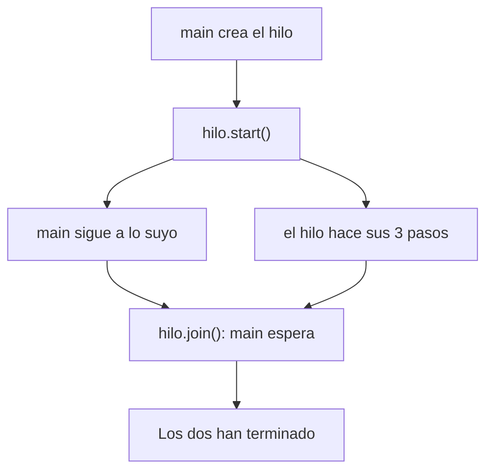

Un programa normal hace una cosa detrás de otra en un único **hilo** de ejecución. Con varios hilos puede hacer varias cosas a la vez: atender a varios usuarios, descargar mientras muestra una interfaz, o repartir un cálculo pesado entre los núcleos del procesador.

> [!analogia]
> Un hilo es como un cocinero en una cocina. Con un solo cocinero, los platos salen uno detrás de otro. Con dos, uno puede pelar patatas mientras el otro fríe huevos. Comparten la cocina, pero cada uno sigue su propia receta.

## Crear un hilo

Un hilo ejecuta un `Runnable`: una interfaz funcional cuyo método `run` no recibe nada ni devuelve nada. Así que basta una lambda:

```java
public class Main {
    public static void main(String[] args) throws InterruptedException {
        Thread hilo = new Thread(() -> {
            for (int i = 1; i <= 3; i++) {
                System.out.println("Hilo secundario: paso " + i);
            }
        });
        hilo.start();      // arranca en paralelo
        System.out.println("El hilo principal sigue a lo suyo");
        hilo.join();       // espera a que termine
        System.out.println("Los dos han terminado");
    }
}
```

- `start()` lanza el hilo y vuelve **inmediatamente**.
- `join()` bloquea hasta que el hilo termina.



> [!prueba]
> Quita la línea `hilo.join();` y ejecuta varias veces: ¿sale siempre «Los dos han terminado» al final? Sin `join`, `main` ya no espera a nadie.

> [!cuidado]
> Llamar a `run()` en vez de `start()` compila y funciona, pero ejecuta el código en el hilo actual, sin paralelismo. Para lanzar un hilo de verdad, siempre `start()`.

## El orden no está garantizado

Ejecuta esto varias veces en el playground:

```java
public class Main {
    public static void main(String[] args) throws InterruptedException {
        Thread a = new Thread(() -> System.out.println("A"));
        Thread b = new Thread(() -> System.out.println("B"));
        a.start();
        b.start();
        a.join();
        b.join();
    }
}
```

A veces verás `A B` y a veces `B A`. El sistema operativo decide cuándo corre cada hilo.

> [!idea]
> **Nunca** dependas del orden de hilos que se ejecutan a la vez. Si necesitas un orden, espera explícitamente (`join`) o combina los resultados al final.

## Esperar: sleep

`Thread.sleep(ms)` pausa el hilo actual durante esos milisegundos. Puede lanzar `InterruptedException`, una checked exception que indica que alguien pidió detener el hilo:

```java
public class Main {
    public static void main(String[] args) {
        try {
            System.out.println("Esperando…");
            Thread.sleep(300);
            System.out.println("¡Listo!");
        } catch (InterruptedException e) {
            Thread.currentThread().interrupt();   // conserva la señal de interrupción
        }
    }
}
```

## Hilos virtuales

Desde Java 21 existen los **hilos virtuales**: hilos ligerísimos gestionados por la JVM. Puedes crear miles sin problema, lo que los hace ideales para tareas que pasan la mayor parte del tiempo esperando (red, base de datos):

> [!analogia]
> Un hilo normal es un camarero en plantilla: caro de contratar. Un hilo virtual es un pedido apuntado en una libreta: puedes tener cientos y solo ocupan a un camarero cuando de verdad hay algo que hacer.

```java
public class Main {
    public static void main(String[] args) throws InterruptedException {
        Thread virtual = Thread.ofVirtual().start(() -> System.out.println("Soy un hilo virtual"));
        virtual.join();
    }
}
```

> [!resumen]
> - Un `Thread` ejecuta un `Runnable` en paralelo: `start()` lo lanza y `join()` espera.
> - El orden entre hilos no está garantizado.
> - `Thread.sleep` pausa; maneja `InterruptedException`.
> - Java 21 añade hilos virtuales para tareas con mucha espera.
