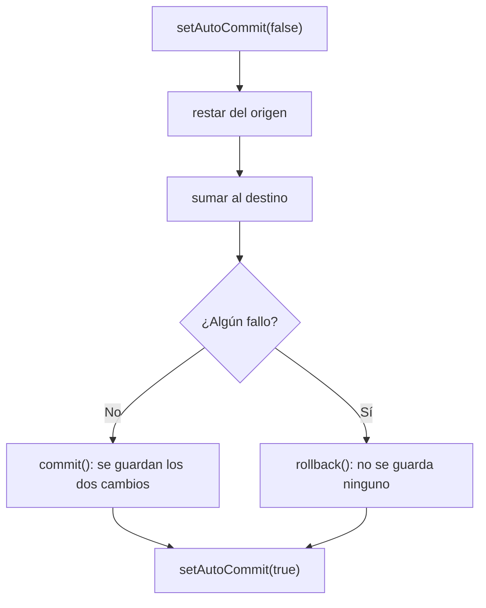
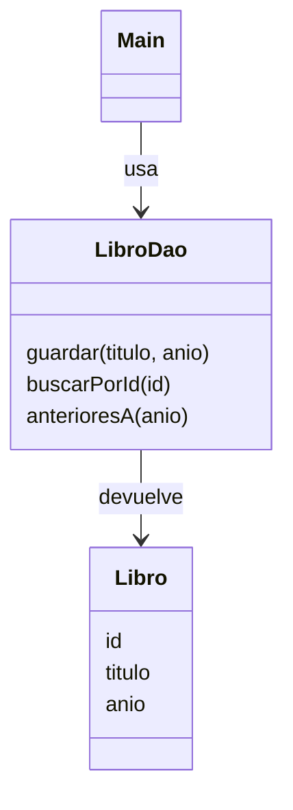

## Todo o nada

Transferir dinero son dos operaciones: restar de una cuenta y sumar a otra. Si la segunda falla después de la primera, el dinero desaparece. Una **transacción** agrupa varias operaciones para que se apliquen **todas o ninguna**.

> [!analogia]
> Una transacción es como mudarte de piso con un contrato: o firmas la salida del viejo **y** la entrada del nuevo, o no firmas nada. Lo que no puede pasar es que te quedes en la calle a mitad de camino.

Por defecto JDBC confirma cada sentencia al momento (*autocommit*). Para agrupar, lo desactivas, y al final confirmas con `commit()` o deshaces con `rollback()`:

```java
import java.sql.Connection;
import java.sql.DriverManager;
import java.sql.PreparedStatement;
import java.sql.ResultSet;
import java.sql.SQLException;
import java.sql.Statement;

public class Main {
    static void transferir(Connection c, String origen, String destino, int cantidad) throws SQLException {
        c.setAutoCommit(false);
        try (PreparedStatement restar = c.prepareStatement("UPDATE cuentas SET saldo = saldo - ? WHERE titular = ?");
             PreparedStatement sumar = c.prepareStatement("UPDATE cuentas SET saldo = saldo + ? WHERE titular = ?")) {
            restar.setInt(1, cantidad);
            restar.setString(2, origen);
            restar.executeUpdate();
            sumar.setInt(1, cantidad);
            sumar.setString(2, destino);
            if (sumar.executeUpdate() == 0) {
                throw new SQLException("No existe la cuenta " + destino);
            }
            c.commit();
        } catch (SQLException e) {
            c.rollback();
            throw e;
        } finally {
            c.setAutoCommit(true);
        }
    }

    static void mostrar(Connection c) throws SQLException {
        try (Statement s = c.createStatement();
             ResultSet r = s.executeQuery("SELECT titular, saldo FROM cuentas ORDER BY titular")) {
            while (r.next()) {
                System.out.print(r.getString(1) + "=" + r.getInt(2) + " ");
            }
            System.out.println();
        }
    }

    public static void main(String[] args) throws SQLException {
        try (Connection c = DriverManager.getConnection("jdbc:h2:mem:banco")) {
            try (Statement s = c.createStatement()) {
                s.execute("CREATE TABLE cuentas (titular VARCHAR(20) PRIMARY KEY, saldo INT CHECK (saldo >= 0))");
                s.execute("INSERT INTO cuentas VALUES ('ada', 100), ('alan', 50)");
            }
            transferir(c, "ada", "alan", 30);
            mostrar(c);                                    // ada=70 alan=80
            try {
                transferir(c, "ada", "nadie", 30);         // falla la segunda parte
            } catch (SQLException e) {
                System.out.println("Fallo: " + e.getMessage());
            }
            mostrar(c);                                    // sin cambios: ada=70 alan=80
        }
    }
}
```



> [!prueba]
> Cambia `c.rollback();` por un comentario (`// c.rollback();`) y vuelve a ejecutar: ¿qué saldos salen tras la transferencia fallida? Ese dinero «desaparecido» es justo lo que evita el rollback.

> [!cuidado]
> Tras un fallo, no olvides restaurar `setAutoCommit(true)` en un `finally`: si no, las siguientes operaciones quedarán sin confirmar sin que te des cuenta.

Fíjate en el `CHECK (saldo >= 0)` de la tabla: la propia base de datos rechaza saldos negativos, otra capa de protección.

## El patrón DAO

> [!analogia]
> Un DAO es como el bibliotecario: tú le pides «el libro número 2» y él sabe en qué estantería mirar. No necesitas conocer cómo está organizado el almacén.

Mezclar SQL con la lógica del programa se vuelve inmanejable. Un **DAO** (*Data Access Object*) encierra todo el acceso a una tabla tras métodos con significado:

```java
import java.sql.Connection;
import java.sql.DriverManager;
import java.sql.PreparedStatement;
import java.sql.ResultSet;
import java.sql.SQLException;
import java.sql.Statement;
import java.util.ArrayList;
import java.util.List;
import java.util.Optional;

record Libro(int id, String titulo, int anio) {}

class LibroDao {
    private final Connection conexion;

    LibroDao(Connection conexion) throws SQLException {
        this.conexion = conexion;
        try (Statement s = conexion.createStatement()) {
            s.execute("CREATE TABLE IF NOT EXISTS libros (id INT AUTO_INCREMENT PRIMARY KEY, titulo VARCHAR(100), anio INT)");
        }
    }

    void guardar(String titulo, int anio) throws SQLException {
        try (PreparedStatement ps = conexion.prepareStatement("INSERT INTO libros (titulo, anio) VALUES (?, ?)")) {
            ps.setString(1, titulo);
            ps.setInt(2, anio);
            ps.executeUpdate();
        }
    }

    Optional<Libro> buscarPorId(int id) throws SQLException {
        try (PreparedStatement ps = conexion.prepareStatement("SELECT * FROM libros WHERE id = ?")) {
            ps.setInt(1, id);
            try (ResultSet r = ps.executeQuery()) {
                return r.next() ? Optional.of(leer(r)) : Optional.empty();
            }
        }
    }

    List<Libro> anterioresA(int anio) throws SQLException {
        List<Libro> libros = new ArrayList<>();
        try (PreparedStatement ps = conexion.prepareStatement("SELECT * FROM libros WHERE anio < ? ORDER BY anio")) {
            ps.setInt(1, anio);
            try (ResultSet r = ps.executeQuery()) {
                while (r.next()) {
                    libros.add(leer(r));
                }
            }
        }
        return libros;
    }

    private static Libro leer(ResultSet r) throws SQLException {
        return new Libro(r.getInt("id"), r.getString("titulo"), r.getInt("anio"));
    }
}

public class Main {
    public static void main(String[] args) throws SQLException {
        try (Connection c = DriverManager.getConnection("jdbc:h2:mem:biblioteca")) {
            LibroDao dao = new LibroDao(c);
            dao.guardar("Ficciones", 1944);
            dao.guardar("Rayuela", 1963);
            dao.guardar("Klara y el Sol", 2021);
            System.out.println(dao.buscarPorId(2));
            System.out.println(dao.anterioresA(2000));
        }
    }
}
```

El resto del programa trabaja con objetos `Libro` y no sabe nada de SQL. Frameworks como Spring Data JPA (el que usa el backend de esta plataforma) generan estos DAO por ti, pero por debajo hacen exactamente esto.



> [!resumen]
> - `setAutoCommit(false)` + `commit()` / `rollback()` agrupan operaciones en una transacción.
> - Haz rollback ante cualquier fallo y restaura el autocommit en un `finally`.
> - Un DAO encierra el SQL de una tabla tras métodos que devuelven objetos.
