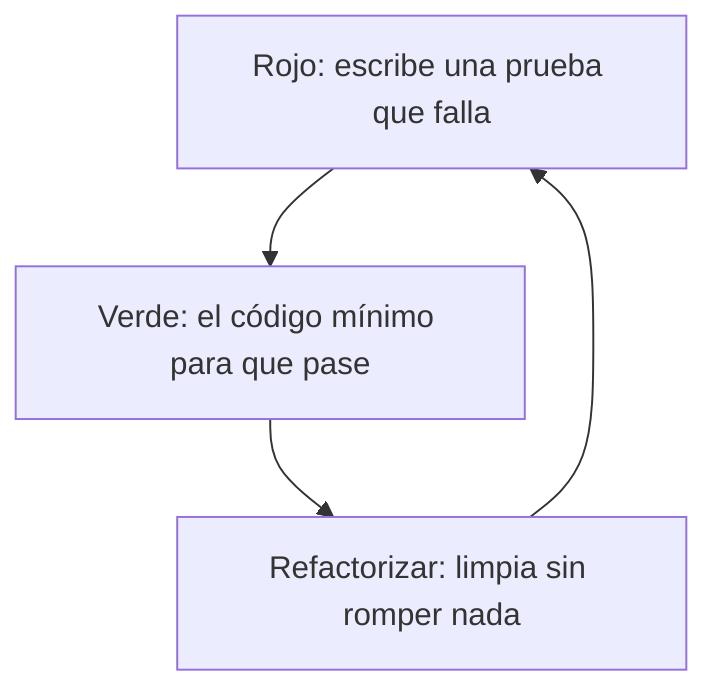

Ya sabes escribir pruebas con JUnit. Ahora vamos a escribirlas mejor: con menos repetición, en el orden adecuado y sin depender de cosas externas.

## Pruebas parametrizadas

> [!analogia]
> Una prueba parametrizada es como una plantilla de carta: escribes el texto una vez y la imprimes con una lista de nombres y direcciones. Cada fila de datos produce una prueba distinta.

Cuando quieres probar la misma lógica con muchos datos, repetir el método es tedioso. `@ParameterizedTest` ejecuta una prueba una vez por cada fila de datos:

```java
import static org.junit.jupiter.api.Assertions.assertEquals;
import static org.junit.platform.engine.discovery.DiscoverySelectors.selectClass;

import org.junit.jupiter.params.ParameterizedTest;
import org.junit.jupiter.params.provider.CsvSource;
import org.junit.platform.launcher.core.LauncherDiscoveryRequestBuilder;
import org.junit.platform.launcher.core.LauncherFactory;
import org.junit.platform.launcher.listeners.SummaryGeneratingListener;

class Calendario {
    static boolean esBisiesto(int anio) {
        return (anio % 4 == 0 && anio % 100 != 0) || anio % 400 == 0;
    }
}

class CalendarioTest {
    @ParameterizedTest
    @CsvSource({
        "2023, false",
        "2024, true",
        "1900, false",
        "2000, true"
    })
    void detectaLosAniosBisiestos(int anio, boolean esperado) {
        assertEquals(esperado, Calendario.esBisiesto(anio));
    }
}

public class Main {
    public static void main(String[] args) {
        var peticion = LauncherDiscoveryRequestBuilder.request().selectors(selectClass(CalendarioTest.class)).build();
        var resumen = new SummaryGeneratingListener();
        LauncherFactory.create().execute(peticion, resumen);
        System.out.println(resumen.getSummary().getTestsSucceededCount() + "/"
                + resumen.getSummary().getTestsFoundCount() + " pruebas superadas");
    }
}
```

Cada fila de `@CsvSource` se convierte en los argumentos del método, y cuenta como una prueba distinta. Añadir un caso es añadir una línea.

> [!prueba]
> Añade la fila `"2100, true"` a `@CsvSource` y vuelve a ejecutar: verás `4/5 pruebas superadas`, porque 2100 no es bisiesto (es divisible entre 100 pero no entre 400). Cámbiala a `"2100, false"` y todo vuelve a pasar.

## TDD: la prueba primero

El **desarrollo guiado por pruebas** (*Test-Driven Development*) invierte el orden habitual con un ciclo corto de tres pasos:

> [!analogia]
> Es como dibujar primero la diana y después lanzar el dardo: sabes exactamente a qué apuntas antes de empezar.

1. **Rojo:** escribe una prueba para algo que el código aún no hace. Ejecútala y comprueba que **falla** (si pasa, la prueba no prueba nada).
2. **Verde:** escribe el código mínimo para que pase.
3. **Refactorizar:** limpia el código (y las pruebas) sin cambiar su comportamiento; las pruebas te avisan si rompes algo.



Y vuelta a empezar con la siguiente prueba. El resultado es código que nace probado y diseñado desde el punto de vista de quien lo usa. Los dos primeros ejercicios de este módulo funcionan así: las pruebas ya están escritas y tu trabajo es que pasen.

## Qué hace buena a una prueba

- **Rápida:** si tardan, nadie las ejecuta.
- **Independiente:** no depende de otras pruebas ni del orden.
- **Repetible:** mismo resultado siempre; nada de horas actuales o datos aleatorios sin controlar (por eso existen los `Clock` fijos que viste en el diseño con interfaces).
- **Clara:** si falla, el nombre y el mensaje deben decir qué se rompió.
- **Una idea por prueba:** varias aserciones están bien si comprueban el mismo comportamiento.

## Dobles de prueba

> [!analogia]
> Un doble de prueba es como el doble de un actor en una escena peligrosa: se parece lo suficiente para rodar, pero no arriesgas al de verdad.

Para probar una clase que depende de algo lento o externo (una base de datos, un servicio de correo), se le pasa una versión falsa que implementa la misma interfaz: un **doble de prueba**. Es otra razón para programar contra interfaces:

```java fragment
class AvisadorFalso implements Avisador {
    final List<String> enviados = new ArrayList<>();

    @Override
    public void avisar(String mensaje) {
        enviados.add(mensaje);   // en vez de mandar un correo, lo apunta
    }
}
```

Bibliotecas como Mockito los generan automáticamente.

> [!resumen]
> - `@ParameterizedTest` con `@CsvSource` prueba muchos casos sin repetir código.
> - TDD: rojo (prueba que falla), verde (código mínimo), refactorizar.
> - Buenas pruebas: rápidas, independientes, repetibles y claras.
> - Los dobles de prueba sustituyen dependencias externas a través de interfaces.
