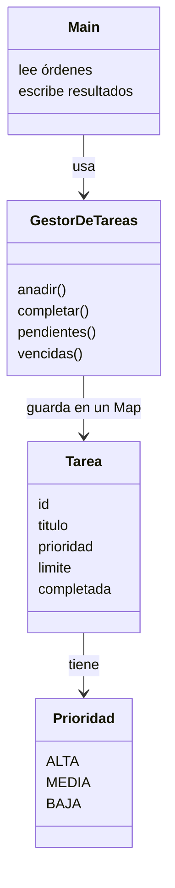

Has llegado al final del recorrido, y eso merece celebrarse: hace unos módulos no sabías qué era una variable. Ahora vas a juntar todo en una aplicación completa: un **gestor de tareas** de línea de comandos. En esta lección la diseñamos, en cinco pasos; en la siguiente, la construimos.

> [!analogia]
> Diseñar antes de programar es como hacer los planos antes de construir una casa. Cambiar una pared en el plano cuesta un borrón; cambiarla cuando ya está levantada cuesta mucho más.

## Paso 1. Los requisitos

Antes de escribir código, decide qué debe hacer. Nuestra lista:

- Añadir una tarea con título, prioridad (alta, media, baja) y fecha límite opcional.
- Marcar una tarea como completada.
- Listar las tareas pendientes, ordenadas por prioridad y luego por fecha límite.
- Ver las tareas vencidas respecto a una fecha.
- Mostrar estadísticas: pendientes, completadas y por prioridad.
- Rechazar órdenes inválidas con mensajes claros, sin que el programa se detenga.

> [!idea]
> Cada requisito es **comprobable**: podrías escribir una prueba para cada uno. Si no sabes cómo comprobar un requisito, todavía no está claro.

## Paso 2. Encontrar el modelo

Un truco sencillo: subraya los sustantivos de los requisitos (*tarea*, *título*, *prioridad*, *fecha límite*, *estado*): suelen ser tus clases y campos. Los verbos (*añadir*, *completar*, *listar*, *ver vencidas*) suelen ser tus métodos.

| Concepto | Lo modelamos como | Por qué |
| --- | --- | --- |
| Prioridad | `enum Prioridad { ALTA, MEDIA, BAJA }` | Conjunto cerrado de valores, con orden |
| Tarea | `record Tarea(int id, String titulo, Prioridad prioridad, LocalDate limite, boolean completada)` | Datos inmutables; "completar" crea una tarea nueva |
| La lista de tareas y sus reglas | `class GestorDeTareas` | Tiene estado que cambia y reglas que proteger |
| Leer órdenes y escribir respuestas | `class Main` | Separar la interfaz de la lógica |

## Paso 3. Repartir responsabilidades



- `Main` no sabe cómo se guardan las tareas; solo llama a métodos del gestor.
- `GestorDeTareas` no sabe nada de `Scanner` ni de `System.out`: recibe datos y devuelve resultados o lanza excepciones. Eso lo hace **fácil de probar**.
- Si mañana la interfaz es web en vez de consola, solo cambia `Main`.

> [!analogia]
> Es como un restaurante: el camarero (`Main`) toma nota y sirve, el cocinero (`GestorDeTareas`) sigue las recetas, y la despensa (el `Map`) guarda los ingredientes. El cliente nunca entra en la cocina.

## Paso 4. Decidir los errores

Qué puede fallar y cómo lo comunicamos:

| Situación | Excepción |
| --- | --- |
| Título vacío, prioridad inexistente | `IllegalArgumentException` |
| Completar una tarea que no existe | `NoSuchElementException` |
| Completar una tarea ya completada | `IllegalStateException` |

`Main` captura esas excepciones y muestra el mensaje: el programa nunca se detiene por una orden mal escrita.

## Paso 5. Elegir las estructuras

- Buscar por id muchas veces → `Map<Integer, Tarea>`.
- Mostrar en orden de creación → `LinkedHashMap`, que conserva el orden de inserción.
- Ordenar por prioridad y fecha → un `Comparator` con `comparing` y `thenComparing`; los enums ya se ordenan por su posición en la declaración.
- Filtrar y contar → streams.

Puedes comprobar ese último detalle de los enums ahora mismo:

```java
import java.util.ArrayList;
import java.util.Collections;
import java.util.List;

enum Prioridad { ALTA, MEDIA, BAJA }

public class Main {
    public static void main(String[] args) {
        List<Prioridad> lista = new ArrayList<>(List.of(Prioridad.BAJA, Prioridad.ALTA, Prioridad.MEDIA));
        Collections.sort(lista);
        System.out.println(lista);
    }
}
```

> [!prueba]
> Cambia la declaración a `enum Prioridad { BAJA, MEDIA, ALTA }` y vuelve a ejecutar: el orden de la lista cambia, porque un enum se ordena por la posición en la que escribiste sus valores.

> [!cuidado]
> No intentes que el diseño sea perfecto a la primera. Un buen diseño es el que es **fácil de cambiar**: clases pequeñas con una responsabilidad, datos inmutables donde se pueda y reglas en un único sitio.

> [!resumen]
> - Empieza por requisitos comprobables, no por el código.
> - Los sustantivos sugieren clases y campos; los verbos, métodos.
> - Separa la interfaz (`Main`) de la lógica (`GestorDeTareas`) para poder probarla y cambiarla.
> - Decide de antemano qué excepciones usarás y qué estructuras de datos encajan.
